**CyberLeek** is an active operation that uses stolen Grand Theft Auto VI material
(Rockstar Games' unreleased IP) as bait for a cryptocurrency it profits from.
This is an open, evidence-backed investigation. Every indicator here is public,
verifiable, and cryptographically hashed, so researchers, defenders, exchanges,
and platforms can identify the operation and act on it.

Maintained by [Deep Woods Security](https://deepwoodssec.com).

## A note on signal and noise

A case like this is mostly noise, and that is the whole difficulty. A hyped token
pulls in thousands of traders, bots, and arbitrage wallets. A loud social account
insists it is "the only real one." A large number sitting on a block explorer looks
like a smoking gun. None of that, on its own, is the operator. The work is not
finding data, there is far too much of it. The work is separating the signal, what
the operator actually did, from everything that only looks related.

The method here is deliberately conservative. Start from what cannot be faked: who
paid to register the site, who signed the file uploads, who created the token.
Follow the funding, because money has to come from somewhere, and that somewhere
tends to be a door. Claim only what a specific transaction proves, not who traded
the most or who posts the loudest. When two things share a name, treat them as
different until a transaction says otherwise.

## A tale of two thieves

There are two separate things carrying the CyberLeek name, and on-chain they do not
connect:

- **The operation (the money).** The leak site `cyber-leek.com`, the Arweave-hosted
  leak distribution, and a live token whose entire setup was funded, through one
  wallet, from a **KuCoin** account. It is quiet, has no confirmed social presence,
  and makes money from trading fees on locked liquidity. This is the real one, and
  the KuCoin account behind it is the identity lead.
- **The persona (the copycat).** A loud Telegram and X account (`@cyberleeksreal`,
  "The Only Real Cyberleek"), the `cyberleeks.fun` domain, and a **pump.fun** token
  that stalled and went nowhere. This is where the human fingerprints are (an
  AI-generated profile picture, a writing style, a daily posting rhythm), but no
  transaction ties any of it to the money.

Whether these are two people, or one operator keeping the loud half walled off from
the paying half, the chain does not link them. So this investigation keeps them
apart, and labels which track each finding belongs to.

## The two tracks

**Track 1 - the operation (the money)**

- [`crypto/`](crypto/) - the funding traced back to KuCoin, the locked-liquidity fee
  model, and the 270M dev-token burn
- [`infrastructure/`](infrastructure/) - hosting, DNS, media delivery, and the
  Arweave leak distribution behind `cyber-leek.com` (also maps the persona's dead
  `cyberleeks.fun` domain)

**Track 2 - the persona (the copycat)**

- [`posting-pattern/`](posting-pattern/) - the Telegram and pump-wallet activity
  rhythm, and how well they match
- [`writing-style/`](writing-style/) - language and writing-style markers
- [`browser/`](browser/) - the persona's browser fingerprint, from their own
  `cyberleeks.fun` screenshot
- [`pfp-metadata/`](pfp-metadata/) - the AI-generated profile picture and its C2PA /
  Grok content-credential provenance

## Timeline

Every dated event below is anchored to a verifiable source: an on-chain block
time, a Certificate Transparency record, or a captured post. Times are UTC, 2026.

```mermaid
flowchart LR
    subgraph FUND["Funding (the money)"]
      direction LR
      A13["Aug 13<br/>KuCoin funds the chain<br/>six hops to 3YLN"] --> A14["Aug 14<br/>Leak-site name<br/>registered (52yK)"] --> A15["Aug 15<br/>$CYBERLEEK minted 14:20Z<br/>liquidity locked"]
    end
    subgraph TRUST["Trust signal"]
      A22["Aug 22<br/>270,000,000 dev<br/>tokens burned"]
    end
    subgraph LAUNCH["Public launch"]
      direction LR
      A24["Aug 24<br/>cyber-leek.com first TLS cert<br/>(HTTPS on) + polls open"] --> A25["Aug 25<br/>Copycat pump.fun token<br/>@cyberleeksreal posting"]
    end
    subgraph RECON["Recon and decline"]
      direction LR
      A27["Aug 27<br/>First passive recon"] --> A28["Aug 28<br/>cyberleeks.fun<br/>goes dark"] --> A29["Aug 29<br/>Site down (HTTP 000)"]
    end
    A15 --> A22 --> A24
    A25 --> A27

    classDef money fill:#dcfce7,stroke:#166534,color:#052e16;
    classDef persona fill:#fee2e2,stroke:#991b1b,color:#450a0a;
    classDef recon fill:#f3f4f6,stroke:#6b7280,color:#111827;
    class A13,A14,A15,A22,A24 money;
    class A25 persona;
    class A27,A28,A29 recon;
```

| When (UTC) | Track | Event | Source |
| --- | --- | --- | --- |
| 2026-08-13 09:22 to 18:47 | money | KuCoin processing wallet (`BmFd`) funds the chain; six hops reach the funding wallet (`3YLN`) | on-chain, [`crypto/evidence/funding_spine/`](crypto/evidence/funding_spine/) |
| 2026-08-14 09:42 | money | ArNS leak-site name wallet (`52yK`) first active (registers the on-chain site name) | on-chain, `funding_spine/arns_52yK_*` |
| 2026-08-15 09:49 | money | Funding wallet pays the buffer (`Ec2q`) | on-chain, `funding_spine/buffer_Ec2q_*` |
| 2026-08-15 12:23 | money | Arweave upload key (`667G`) first active (signs the permanent leak uploads) | on-chain, `funding_spine/arweave_667G_*` |
| 2026-08-15 14:20:54 | money | Token creator (`Hok9`) mints `$CYBERLEEK` (`ApZux`); liquidity locked on Raydium | on-chain, `funding_spine/creator_Hok9_*` (instruction `TOKEN_MINT`) |
| 2026-08-22 18:27:59 | money | 270,000,000 dev tokens burned via holding wallet (`Cbfb`) | on-chain, `funding_spine/hold270_Cbfb_*` (instruction `BURN`) |
| 2026-08-24 | money | `cyber-leek.com` first Let's Encrypt certificate issued (HTTPS on). A lower bound, not the domain registration date, which is still to be pulled (see infrastructure/) | Certificate Transparency, [`infrastructure/recon/dns-cert-recon.txt`](infrastructure/recon/dns-cert-recon.txt) |
| 2026-08-24 | money | Pay-to-vote poll option wallets (`Cpj7`, `3wFK`) first active | on-chain, `complete_history/poll_*` |
| 2026-08-25 06:33:48 | persona | Copycat pump.fun token (`2hRg6`) minted by deployer (`HhFa`) | on-chain, [`infrastructure/`](infrastructure/) on-chain table |
| 2026-08-25 07:08 | persona | `@cyberleeksreal` Telegram persona's first captured post | [`posting-pattern/telegram-post-times.txt`](posting-pattern/telegram-post-times.txt) |
| 2026-08-27 | recon | First passive infrastructure recon (DNS, IP, TLS, CT) | [`infrastructure/recon/dns-cert-recon.txt`](infrastructure/recon/dns-cert-recon.txt) |
| 2026-08-28 | recon | Re-verification: Cloudflare DNS change; `cyberleeks.fun` goes dark (no A record) | [`infrastructure/recon/infra-recon-2026-08-28.txt`](infrastructure/recon/infra-recon-2026-08-28.txt) |
| 2026-08-29 | recon | `cyber-leek.com` down (HTTP 000) on an independent re-pull; DNS still resolves to InterServer | [`infrastructure/recon/infra-recon-2026-08-29.txt`](infrastructure/recon/infra-recon-2026-08-29.txt) |

The shape of it: the money was funded from a KuCoin account and the token built and
burn-signalled over roughly ten quiet days (Aug 13 to 22), then the site's HTTPS
and the loud persona came in the Aug 24 to 25 window (the true domain-registration
date is still to be pulled), and within days the site went dark while the on-chain
records stayed permanent.

## Evidence integrity (chain of custody)

Every artifact cited in this repo is hashed and timestamped so anyone can confirm it
has not been altered since collection:

- **SHA256** of each source artifact is recorded in [`EVIDENCE.md`](EVIDENCE.md).
- **UTC capture time** is recorded next to each hash.
- **archive.ph** snapshots provide an independent, third-party timestamp for the
  live pages and posts.
- The crypto trail is reproducible from raw transactions; the on-chain evidence
  package verifies against its own SHA256 manifest.

Raw sensitive material (for example the leaked frames) is **not** published here. Its
hash and archive link are enough to prove it existed and is unchanged, without
redistributing it.

## Deliberately not here

- No leaked media. The stolen frames are not redistributed.
- No personal-identity attribution. This documents the operation, not a named
  individual. We make no claim about whether the money operation and the social
  persona are the same actor, whether either is one person or a group, or where they
  are located. Those determinations are left to law enforcement. "Operator" and
  "persona" are neutral shorthand.

## Contributing

PRs welcome if verifiable from public sources. Cite every indicator with a
block-explorer link, an archive.ph snapshot, or a transaction hash, and include the
artifact's SHA256. No PII, no leaked media, no accusations against named people.

## Credit

The funding-to-KuCoin trace in [`crypto/`](crypto/) was first published by GTAForums
user [Vice Cit](https://gtaforums.com/topic/994376-spoilers-gta-vi-leaks-analysis-thread-part-ii/page/314/#comment-1072766077) and reproduced here independently.

## Victims

Report to https://www.ic3.gov with your transaction hashes, wallet addresses, and
timestamps.
