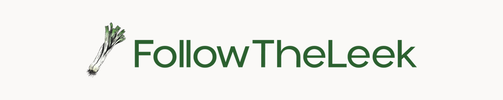
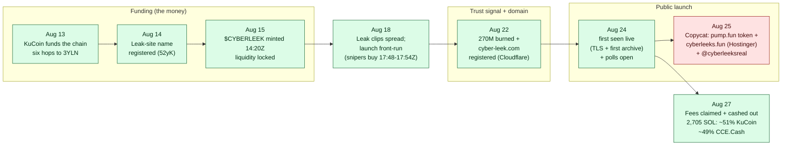

**CyberLeek** is an active operation that uses stolen Grand Theft Auto VI material
(Rockstar Games' unreleased IP) as bait for a cryptocurrency it profits from.
We keep this investigation open and evidence-backed. Every indicator is public,
verifiable, and cryptographically hashed, so researchers, defenders, exchanges,
and platforms can identify the operation and act on it.

Maintained by [Deep Woods Security](https://deepwoodssec.com).

## A note on signal and noise

A case like this is mostly noise, and that is the hard part. A hyped token pulls in
thousands of traders, bots, and arbitrage wallets. A loud account insists it is
"the only real one." A big number on a block explorer looks like a smoking gun. None
of that, by itself, is the operator. Our problem was never finding data, there is far
too much of it. It was separating the signal, what the operator actually did, from
everything that only looks related.

We kept the method conservative. We started from what cannot be faked: who paid to
register the site, who signed the file uploads, who created the token. We followed
the funding, because the money has to come from somewhere, and that somewhere is
usually a door. We claim only what a specific transaction proves, not who traded the
most or who posts the loudest. And when two things share a name, we treat them as
different until a transaction says otherwise.

## The operation and the copycat

There are two separate things carrying the CyberLeek name, and on-chain they do not
connect:

- **The operation (the money).** The leak site `cyber-leek.com`, the Arweave-hosted
  leak distribution, and a live token whose entire setup was funded, through one
  wallet, from a **KuCoin** account. It is quiet, has no confirmed social presence,
  and makes money from trading fees on locked liquidity. This is the real one, and
  the KuCoin account behind it is our identity lead.
- **The persona (the copycat).** A loud Telegram and X account (`@cyberleeksreal`,
  "The Only Real Cyberleek"), the `cyberleeks.fun` domain, and a **pump.fun** token
  that stalled and went nowhere. This is where the human fingerprints are (an
  AI-generated profile picture, a writing style, a daily posting rhythm), but no
  transaction ties any of it to the money.

Whether these are two people, or one operator running the persona separately from
the money, the chain does not link them. So we keep them apart, and label
which track each finding belongs to.

## The two tracks

**Track 1 - the operation (the money)**

- [`crypto/`](real/crypto/) - the funding traced back to KuCoin, the locked-liquidity fee
  model, and the 270M dev-token burn
- [`infrastructure/`](real/infrastructure/) - hosting, DNS, media delivery, and the
  Arweave leak distribution behind `cyber-leek.com` (also maps the persona's dead
  `cyberleeks.fun` domain)
- [`operator/`](real/operator/) - who is behind it: the open, publicly reported
  attribution lead (the `stayonthegrindd` Discord handle, the `Cyberleeker` Dread
  post) and the method to test it against the on-chain clock. No person is named.

**Track 2 - the persona (the copycat)**

- [`posting-pattern/`](copycat/posting-pattern/) - the Telegram and pump-wallet activity
  rhythm, and how well they match
- [`writing-style/`](copycat/writing-style/) - language and writing-style markers
- [`browser/`](copycat/browser/) - the persona's browser fingerprint, from their own
  `cyberleeks.fun` screenshot
- [`pfp-metadata/`](copycat/pfp-metadata/) - the AI-generated profile picture and its C2PA /
  Grok content-credential provenance

## A coordinated operation, exposed at the source

Taken together, the operation was careful and deliberate. This was not a lucky
memecoin that happened to catch a leak. Every stage shows planning:

- **It built trust before it sold.** Days before launch, the creator burned the dev
  allocation (270M tokens) and locked the liquidity on Raydium, the two standard
  "this is not a rug" signals, done deliberately and early.
- **It took real capital to start.** Locking that liquidity meant committing about
  330 SOL (~$29,000 at the time) upfront that could not be pulled back out. That is a
  deliberate stake, not a zero-budget launch, and it came from the same KuCoin
  account, so real money entered through an identity-verified exchange.
- **The launch was timed, and someone was ready.** The leak clips did not drop at
  random. When they did, four wallets bought the token inside a six-minute window,
  none of them tracing to the deployer, which points to insider timing: somebody
  knew the exact moment.
- **The money trail was built to resist tracing.** The funding runs six hops before
  it reaches the token, and the chain is salted with look-alike decoy wallets that
  send anyone tracing it by eye onto dead ends. Whoever placed them, the effect is a
  trail that is harder to follow.
- **Traffic was paid for, not hoped for.** The site is advertised through a Google
  Ads account, so the audience was bought rather than earned.
- **The name and the money never touch on-chain.** No social account behind the
  CyberLeek name appears in a single transaction with the wallets that hold the
  money.

And yet the whole setup was paid for from a **KuCoin** account, a KYC exchange that
has the account holder's real identity on file. Every layer above was built to slow
a tracer down, but none of it changes the ending, because the money started at an
exchange that knows who owns the account. The operation is sophisticated almost
everywhere, except at the one point that matters for identifying who runs it.

## Timeline

Every dated event below is anchored to a verifiable source: an on-chain block
time, a Certificate Transparency record, or a captured post. Times are UTC, 2026.

| When (UTC) | Track | Event | Source |
| --- | --- | --- | --- |
| 2026-08-13 09:22 to 18:47 | money | KuCoin processing wallet (`BmFd`) funds the chain; six hops reach the funding wallet (`3YLN`) | on-chain, [`operation/funding_spine/`](real/crypto/evidence/operation/funding_spine/) |
| 2026-08-14 09:42 | money | ArNS leak-site name wallet (`52yK`) first active (registers the on-chain site name) | on-chain, `operation/funding_spine/arns_52yK_*` |
| 2026-08-15 09:49 | money | Funding wallet pays the buffer (`Ec2q`) | on-chain, `operation/funding_spine/buffer_Ec2q_*` |
| 2026-08-15 12:23 | money | Arweave upload key (`667G`) first active; first Arweave leak upload follows. The leaks were **first posted on the dark-web forum Dread**, then mirrored to Arweave here, before any clearnet site (Dread origin per Vice Cit) | on-chain, `operation/funding_spine/arweave_667G_*` |
| 2026-08-15 14:20:54 | money | Token creator (`Hok9`) mints `$CYBERLEEK` (`ApZux`); liquidity locked on Raydium | on-chain, `operation/funding_spine/creator_Hok9_*` (instruction `TOKEN_MINT`) |
| 2026-08-18 17:48 to 17:54 | money | Leak clips spread and the `$CYBERLEEK` launch is front-run: four wallets buy in a ~6-minute window, none tracing to the deployer (Divyasshree N / Bitquery, confirmed on our pull) | on-chain, [`operation/crosscheck/`](real/crypto/evidence/operation/crosscheck/) |
| 2026-08-22 06:36:48 | money | `cyber-leek.com` domain registered through **Cloudflare** (registrar IANA 1910) | RDAP + WHOIS, [`operation-recon-2026-08-29.txt`](real/infrastructure/recon/operation-recon-2026-08-29.txt) |
| 2026-08-22 18:27:59 | money | 270,000,000 dev tokens burned via holding wallet (`Cbfb`) | on-chain, `operation/funding_spine/hold270_Cbfb_*` (instruction `BURN`) |
| 2026-08-24 | money | `cyber-leek.com` first *seen* live: first Let's Encrypt cert and earliest archive snapshot (14:20Z). Domain registered Aug 22; exact go-live in the Aug 22 to 24 window is not independently recorded | Certificate Transparency + archive.today |
| 2026-08-24 | money | Pay-to-vote poll option wallets (`Cpj7`, `3wFK`) first active | on-chain, `operation/polls/` |
| 2026-08-25 06:33:48 | persona | Copycat pump.fun token (`2hRg6`) minted by deployer (`HhFa`) | on-chain, [`infrastructure/`](real/infrastructure/) on-chain table |
| 2026-08-25 07:08 | persona | `@cyberleeksreal` Telegram persona's first captured post | [`posting-pattern/telegram-post-times.txt`](copycat/posting-pattern/telegram-post-times.txt) |
| 2026-08-25 12:11:02 | persona | `cyberleeks.fun` domain registered through **Hostinger** (a different registrar from the operation) | WHOIS, [`copycat-recon-2026-08-29.txt`](real/infrastructure/recon/copycat-recon-2026-08-29.txt) |
| 2026-08-27 07:27 to 07:32 | money | Creator (`Hok9`) claims locked-LP fees, swaps 15.49M `$CYBERLEEK` to SOL, then splits 2,705 SOL out roughly in half: ~51% back to KuCoin (including a leg laundered through a hub) and ~49% to the no-KYC CCE.Cash (Vice Cit Part 4, full split reproduced on our own pull) | on-chain, [`operation/crosscheck/`](real/crypto/evidence/operation/crosscheck/) |

The shape of it: the money was funded from a KuCoin account and the token built and
burn-signalled over roughly ten days (Aug 13 to 22, with the leak clips spreading
and the launch front-run by snipers on Aug 18). Then `cyber-leek.com`
was registered through Cloudflare (Aug 22) and first seen serving by Aug 24 (it
went live somewhere in that Aug 22 to 24 window; the exact moment is not
independently recorded), and the copycat spun up Aug 25 on a different registrar
(Hostinger). On Aug 27 the operator took profit: the locked-LP fees were claimed,
swapped to SOL, and split back to KuCoin and the no-KYC CCE.Cash. Every dated event here is a
hard on-chain block time, an RDAP/WHOIS record, or a Certificate Transparency
record, not an observation date.

## Evidence integrity (chain of custody)

Every artifact cited in this repo is hashed and timestamped so anyone can confirm it
has not been altered since collection:

- **SHA256** of each source artifact is recorded in [`EVIDENCE.md`](EVIDENCE.md).
- **UTC capture time** is recorded next to each hash.
- **archive.ph** snapshots provide an independent, third-party timestamp for the
  live pages and posts.
- The crypto trail is reproducible from raw transactions; the on-chain evidence
  package verifies against its own SHA256 manifest.

Raw sensitive material (for example the leaked frames) is **not** published here. Its
hash and archive link are enough to prove it existed and is unchanged, without
redistributing it.

## Deliberately not here

- No leaked media. The stolen frames are not redistributed.
- No personal-identity attribution. This documents the operation, not a named
  individual. We make no claim about whether the money operation and the social
  persona are the same actor, whether either is one person or a group, or where they
  are located. Those determinations are left to law enforcement. "Operator" and
  "persona" are neutral shorthand.

## Contributing

PRs welcome if verifiable from public sources. Cite every indicator with a
block-explorer link, an archive.ph snapshot, or a transaction hash, and include the
artifact's SHA256. No PII, no leaked media, no accusations against named people.

## Credit

The funding-to-KuCoin trace in [`crypto/`](real/crypto/) was first published by GTAForums
user [Vice Cit](https://gtaforums.com/topic/994376-spoilers-gta-vi-leaks-analysis-thread-part-ii/page/314/#comment-1072766077) and reproduced here independently.

The launch front-run (sniper wallets) and the address-poisoning on the funding
trail were first published by **Divyasshree N** of Bitquery
([part 1](https://bitquery.io/investigations/cyberleek-gta6-leak-coin),
[part 2](https://bitquery.io/investigations/cyberleek-deployer-funding-trace))
and verified here independently on-chain. Their "serial launcher" and Central
European timezone reads did not hold on our re-pull; see
[`real/crypto/`](real/crypto/) and [`real/operator/`](real/operator/).

Branding and the FollowTheLeek logo by [maegraphics](https://www.maegraphics.com/).

## Victims

Report to https://www.ic3.gov with your transaction hashes, wallet addresses, and
timestamps.
