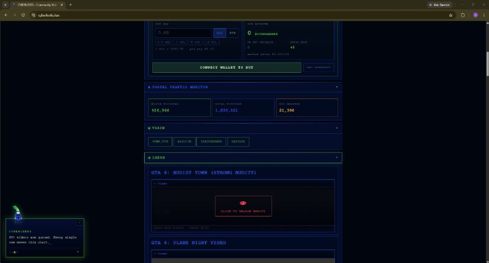
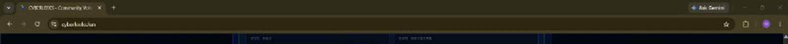
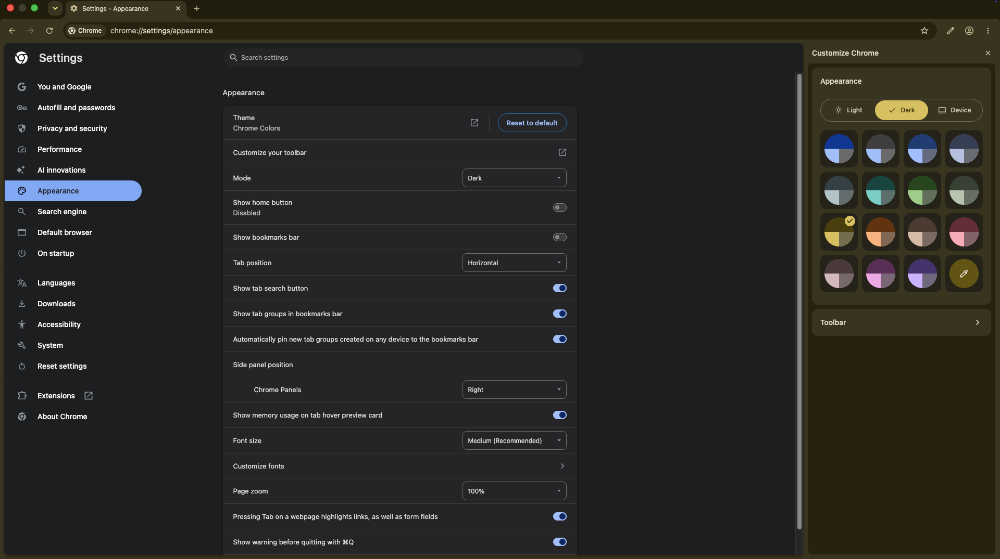

# Browser: the persona's browser fingerprint

> **Which track: the persona, not the money.** This section documents the loud
> half of the case: the `@cyberleeksreal` Telegram / X account, the
> `cyberleeks.fun` domain, and a pump.fun token that stalled. On-chain, none of it
> connects to the KuCoin-funded wallets behind the live token and the leak site
> (see [`../../real/crypto/`](../../real/crypto/)). Whether this persona is the money operator
> keeping a loud alias walled off, or a copycat riding the brand, is unproven.
> Read what follows as observations about the persona, not an identification of
> whoever holds the money.

*The persona's own Chrome window on cyberleeks.fun - the olive-yellow Citron theme across the toolbar and the Ask Gemini button, top right.*

*Zoomed in on the browser chrome from the same capture: the olive-yellow Citron toolbar, the `cyberleeks.fun` address bar, the signed-in account avatar, and the Ask Gemini button.*

The persona account posted screen captures taken on its own machine while
viewing cyberleeks.fun. Those captures leak a consistent environment
fingerprint. Any one attribute is common; taken together, and cross-referenced
against the Google account that accessed the site, they narrow the persona
profile. This is the persona track, not the money; nothing here is tied on-chain
to the operation's wallets.

## In plain terms

Your computer's core software is its **operating system** (Windows, macOS, or
Linux). The program you use to open websites is a **web browser** (Chrome,
Safari, Firefox). The persona account holder posted screenshots of his own screen, and those
pictures give away several of these settings at once: he is on **Windows**,
using **Google Chrome**, with a specific built-in color **theme**, and he is
**signed in to a Google account** (a Google AI feature called Gemini is
switched on in his browser, which only happens when you are logged in). None of
these is unusual on its own. Together they form a distinctive profile, and the
Google sign-in is the strongest lead: while you are signed in, Chrome quietly
**syncs** your settings, browsing history, and saved logins up to that Google
account, so Google holds records that tie all of it back to one person.

## What the capture shows

- **Operating system:** Microsoft Windows
- **Browser:** Google Chrome
- **Theme:** Chrome's built-in "Citron" color, dark mode
- **Google account:** signed in (Gemini active, account avatar present)
- **Context:** the persona's own screenshot of its own site (cyberleeks.fun)

## Operating system: Windows

The window controls - minimize, maximize, close - sit in the top-right
corner in the standard Windows arrangement. macOS places its controls in
the top-left as three colored circles. Their absence, and the presence
of the top-right Windows set, identifies the host as Windows. This rules
out macOS and Linux for the machine in the capture.

## Browser and theme: Chrome, Citron (dark)

The browser is Google Chrome. The toolbar and tab strip render in an
olive-yellow that matches Chrome's built-in **Citron** color theme in
dark mode (toolbar color sampled at approximately `#2e2b18`). This is a
built-in preset chosen under Settings > Appearance, not a custom theme
or a Chrome Web Store install - which means it is a deliberate,
reproducible setting on the signed-in profile rather than a one-off.

*Reference: Chrome's built-in Appearance panel (Settings > Appearance), Dark mode with the Citron color preset selected. The persona's sampled toolbar color (about `#2e2b18`) matches this built-in preset, not a custom or Web Store theme. This is how the theme was identified.*

## Signed-in Google account

Two independent signals show an active Google sign-in:

- The **Ask Gemini** button in the toolbar. Gemini in Chrome is bound to
  a signed-in Google account with the feature enabled.
- A **colored account avatar** (purple, default monogram style, no
  custom photo) next to the menu. Chrome only shows this avatar when a
  profile is signed in.

Chrome Sync ties the theme, extensions, history, and open tabs above to
this Google account. That account is the anchor.

## Context: the persona's own view of its own site

The capture is the persona's own screenshot of cyberleeks.fun, taken on
its working machine, not a visitor's view. The environment shown - the
OS, the browser, the theme, the signed-in account - is therefore the persona
account holder's real day-to-day setup, not a throwaway.

## Why it matters

The value is the **combination**: Windows + Chrome + Citron-dark + a
signed-in Google account + Gemini is a specific, reproducible profile.
The anchor is the Google account that accessed and viewed the site; the
settings above are corroboration Google can confirm from Chrome Sync and
account records on a targeted request. It is a narrowing signal, not a
standalone identifier.

## How it was found

Read directly from pixels in the persona's own posted captures:

- window-control placement -> operating system (Windows)
- toolbar color sampled and matched to Chrome's Citron preset -> theme
- the Ask Gemini button and the account avatar -> active Google sign-in

## Sources

- The screenshot is the image embedded in Telegram post `t.me/cyberleeksreal/24` (archived: https://archive.ph/I0X9X); its SHA256 is recorded in [`../../EVIDENCE.md`](../../EVIDENCE.md).
