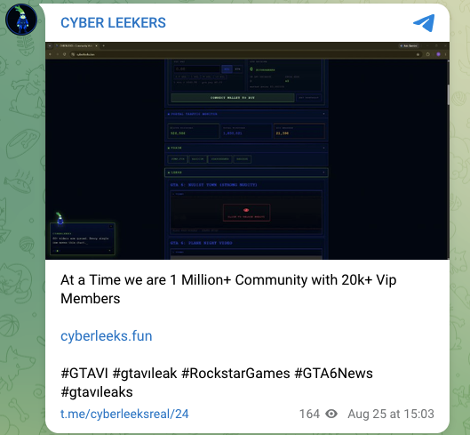

# Language and writing style

> **Which track: the persona, not the money.** This section documents the loud
> half of the case: the `@cyberleeksreal` Telegram / X account, the
> `cyberleeks.fun` domain, and a pump.fun token that stalled. On-chain, none of it
> connects to the KuCoin-funded wallets behind the live token and the leak site
> (see [`../../real/crypto/`](../../real/crypto/)). Whether this persona is the money operator
> keeping a loud alias walled off, or a copycat riding the brand, is unproven.
> Read what follows as observations about the persona, not an identification of
> whoever holds the money.

Documented language from the persona's own channel, the `@cyberleeksreal`
Telegram. Every item is a direct quote from captured posts; the notes are limited
to what is observable in the text. This is a language observation, not an
identification.

## In plain terms

The way a person writes is almost as individual as a fingerprint, and the
practice of studying it to identify or link authors even has a name:
**stylometry**. People repeat the same small, mostly unconscious habits,
particular spellings, spacing, punctuation, and word choices, without ever
noticing they do it. This section collects the persona's quirks from its Telegram
posts, with a direct quote for every one. Together they form a consistent
authorial style across the channel, a distinctive fingerprint, and a few of the
habits are traces of a native language showing through the English. It is a set
of observations, not a name.

## Source

- Telegram channel `t.me/cyberleeksreal` (archived: https://archive.ph/OnLUN).
  Sample of 12 posts verbatim in
  [`telegram-messages.txt`](telegram-messages.txt); every marker below is a
  direct quote.

## Hashtag signature: the dotless "ı"

*Telegram post `t.me/cyberleeksreal/24` (archived: https://archive.ph/I0X9X).*

The recurring hashtag is written **`#gtavıleak`** - using **`ı` (U+0131, Latin
small letter dotless i)** in place of the ASCII `i`. The same dotless character
recurs in `#gtavı` and `#gtavıleaks`. This is a consistent, non-standard
substitution across multiple posts and is the persona's most distinctive
stylistic fingerprint. (U+0131 is the dotless i of Turkish/Azerbaijani
orthography; recorded here as a character-usage fact, not a location claim.)

Full hashtag set observed: `#gtavıleak`, `#gtavı`, `#gtavıleaks`, `#GTAVI`,
`#RockstarGames`, `#GTA6News`, `#GTA`, plus `@RockstarGames` mentions.

## Currency symbol after the amount

> "THIS WILL MAKE 300K+$"
> "ROI 115K$"
> "INVEST IT ONLY 20$"

A post-fixed currency symbol (the number first, then `$`). Common well outside US
English; recorded as a habit.

## "GAVE" for "give" (repeated)

> "THIS WILL GAVE YOU ROI 115K$"
> "I WILL GAVE HIM LEAKS"

The same tense substitution appears twice.

## Other broken-English markers (quoted)

*Telegram post `t.me/cyberleeksreal/31` (archived: https://archive.ph/9J4OI).*

> "DON'T JUDGE A BOOK BY IT'S COVER" - "IT'S" used for possessive "its"
> "if you boost this i will give you one more leaks" - "one more leaks" (number/plural disagreement)
> "JUST YOU NEED GO" - dropped "to"
> "Rockstar just reached to me" - "reached to me" for "reached out to me / reached me"
> "Our main X account has officially reported by Rockstar Games" - missing "been" (broken passive)
> "we are still release leaks" - for "we are still releasing leaks" (verb form)
> "rockstar is jumpingon it" - missing space
> "IF MY POEPLE MAKE MONEY" - "POEPLE" for "people"
> "OUR TWTTER ACCOUNT" - "TWTTER" for "Twitter"

## Punctuation habit: two-dot ellipsis

> "They want us to stop..   They thought I'd take their money. Fools..   They're scared of us.."
> "Good morning guys.. More leaks coming today.." (t.me/cyberleeksreal/33, archived: https://archive.ph/zkVZh)

Consistent `..` (two dots) rather than `...`.

## Crypto / market vernacular (fluent)

> "50MC GOAL IS SOOOO EASY FOR US ... All you guys will be RICH!"
> "+642% in the last 24 hours. Read that again."

(`MC` = market cap; `50MC` = a $50M target.) The broken general English sits next
to fluent crypto-trading slang, someone at home in the market register even where
the English grammar is not.

## Authenticity framing

> "The Only Real Cyberleek - I'm officially on Telegram"

The persona repeatedly insists it is the "only real" one, the same claim baked
into the `@cyberleeksreal` handle.

## Hype register

> "SUUUUUUUUUUUUUUUUUU!", "HAHA  BOOM!", "ROCKSTAR GAMES ARE WEEPING IN THE CORNER HAHA"

## Reading

Across the Telegram channel the same non-standard habits recur: the dotless `ı`
in the hashtags, two-dot ellipses, "gave" for "give", the broken passive, and a
post-fixed currency symbol. Together they are a consistent authorial style, a
distinctive fingerprint for the `@cyberleeksreal` persona. The dotless `ı`
(U+0131) is a Turkish/Azerbaijani character, recorded as a character-usage
observation and not used to claim a native language or origin. These are
observations about the persona's writing, on the persona track only; nothing here
is a marker of, or a link to, the money wallets.
