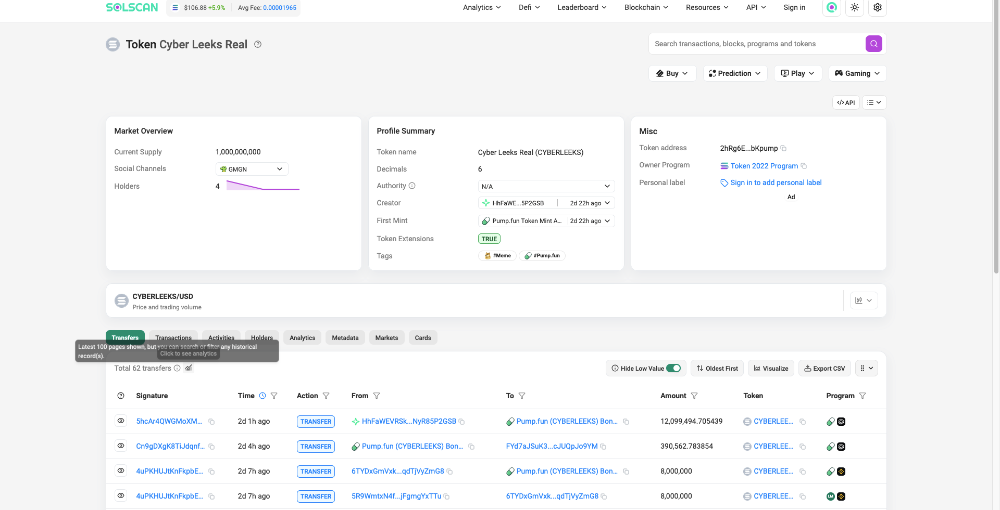
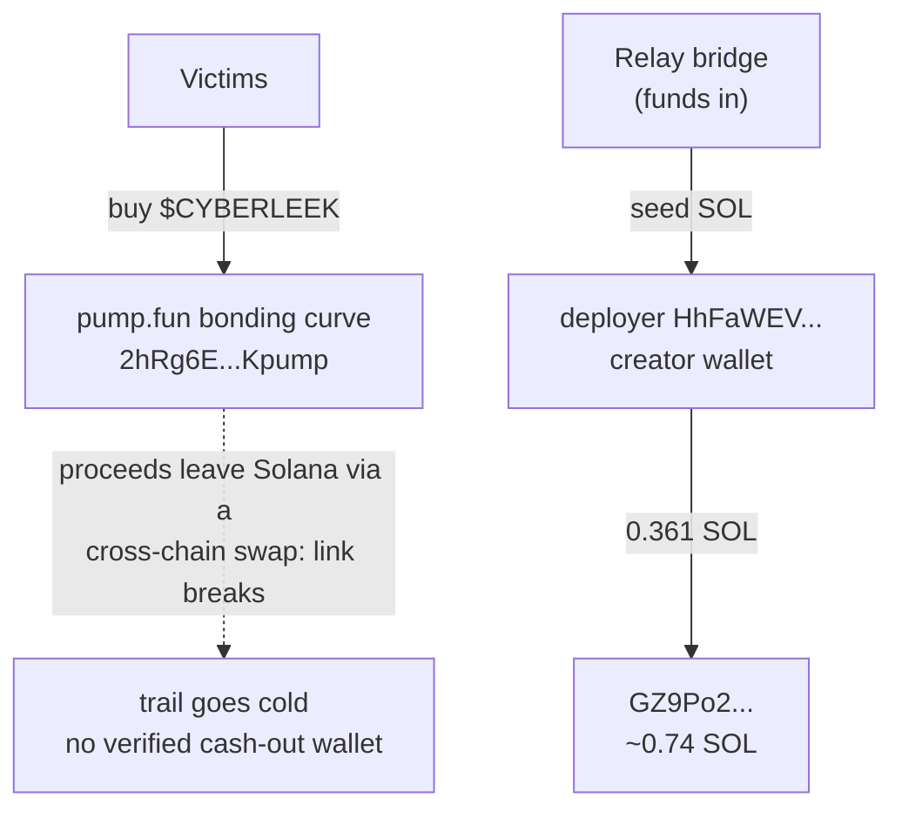

# Crypto: what the chain proves, and where it stops

Passive on-chain analysis of the CyberLeek scam token on Solana. Every
address here is verifiable on a block explorer. This section is
deliberate about where the trail ends: when the money leaves Solana the
public link breaks, and we say so plainly instead of guessing past it.

## 1. The token (Solana)

The scam token, CYBERLEEKS, is minted at:

    2hRg6EhT2Z21xKPDnzniENFbQzLazoSjwt6K26bKpump

A Token-2022 mint named "Cyber Leeks Real" — 1,000,000,000 supply, 6
decimals, launched via pump.fun. It is the top of the funnel: the branded
GTA-leak lures push people to buy it.

*The CYBERLEEKS mint on Solscan: Token-2022, 1B supply, 6 decimals,
Creator `HhFaWE...5P2GSB` (the deployer below), launched via pump.fun.*

## 2. The deployer

The mint was created **2026-08-25T06:33:48Z** by the fee payer on the
creation transaction:

    HhFaWEVRSktrUo3TnUdVrDmE6LHbkEi5rwNyR85P2GSB

This is the operator's on-ramp wallet. It was itself **funded through the
Relay cross-chain bridge** — Relay solver
`F7p3dFrjRTbtRp8FRF6qHLomXbKRBzpvBLjtQcfcgmNe` sent it its initial SOL —
which means the operator moved value onto Solana through a bridge to seed
the launch. (The Relay solver is shared infrastructure used by many
people; it is **not** the operator, and its balance is not the operator's
money. It is noted only as the funding path.)

## 3. Where the money actually sits

Victim SOL flows into the pump.fun **bonding curve**, not into the
deployer wallet. The deployer wallet itself moved well under 1 SOL total
and currently holds dust; its one non-trivial outflow, 0.361 SOL, landed
in `GZ9Po2CCtjc99vvRSeAQ2zzBDYA8HqYxYTDZdHhHURLc` (which holds ~0.74 SOL).
The deployer is the **creator** wallet, not a revenue vault.

The "$17M market cap" advertised on the site is **nominal** (token supply
× price), not extracted money. The on-chain SOL actually moving through
the operator's own wallets is small.

## 4. Where the trail goes cold — stated honestly

We do **not** have a verified on-chain path for the proceeds leaving
Solana, and we do not assert one.

A cross-chain swap or bridge breaks the public on-chain link **by
design**: value goes into a service on one chain and unrelated value comes
out on another, with no ledger connection between them. Any Ethereum-side
"cash-out wallet" named without the swap service's own records would be a
guess, and those records are not public. So this section stops at the edge
of what the chain proves.

That edge is the honest limit of an outside trace. The parties that could
close it — the bridge/swap service, and whatever exchange the operator
ultimately cashes to — are exactly the ones holding the private records
the public ledger does not. Those are the subpoena targets.

## Flow diagram

## Indicators

| Type | Value |
|------|-------|
| Solana token mint (CYBERLEEKS) | `2hRg6EhT2Z21xKPDnzniENFbQzLazoSjwt6K26bKpump` |
| Token deployer wallet | `HhFaWEVRSktrUo3TnUdVrDmE6LHbkEi5rwNyR85P2GSB` |
| Deployer funding path (bridge-in) | Relay solver `F7p3dFrjRTbtRp8FRF6qHLomXbKRBzpvBLjtQcfcgmNe` (shared infra, not the operator) |
| Deployer's largest outflow target | `GZ9Po2CCtjc99vvRSeAQ2zzBDYA8HqYxYTDZdHhHURLc` |

## Reproduce it

Deployer signatures and flows:

    curl -s https://api.mainnet-beta.solana.com -X POST -H 'content-type: application/json' \
      -d '{"jsonrpc":"2.0","id":1,"method":"getSignaturesForAddress","params":["HhFaWEVRSktrUo3TnUdVrDmE6LHbkEi5rwNyR85P2GSB",{"limit":50}]}'

Token supply and largest accounts:

    curl -s https://api.mainnet-beta.solana.com -X POST -H 'content-type: application/json' \
      -d '{"jsonrpc":"2.0","id":1,"method":"getTokenLargestAccounts","params":["2hRg6EhT2Z21xKPDnzniENFbQzLazoSjwt6K26bKpump"]}'

## Confidence and limits

- **Proven on-chain:** the token, the deployer identity and creation time,
  the deployer's funding via the Relay bridge, and the deployer's SOL
  movements. All reproducible from the calls above.
- **Not established:** the path of the proceeds off Solana, and any
  specific cash-out wallet on another chain. A cross-chain swap breaks the
  public link, and this repo does not claim to follow the money across it.
