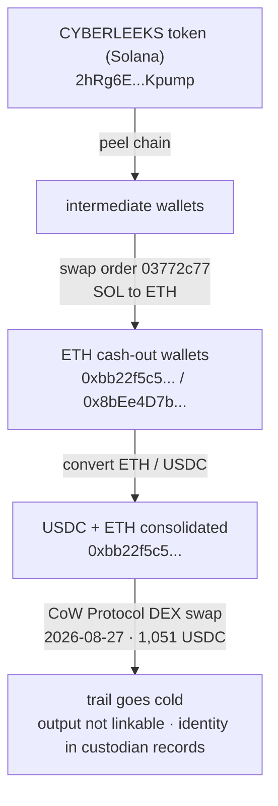

# Crypto: tracing the money

How the CyberLeek scam moves victim funds, traced end to end from public
on-chain data. Every address here is verifiable on a block explorer.

## The trace, step by step

**1. The token (Solana).**
The scam token, CYBERLEEKS, is minted at:

    2hRg6EhT2Z21xKPDnzniENFbQzLazoSjwt6K26bKpump

This is the mint (contract address / CA), a Token-2022 token named
"Cyber Leeks Real". It is the top of the funnel: the branded lures push
people to buy it. Victims' SOL flows to the bonding curve, and the
operator drains the proceeds into the wallets traced below. (Note: the
mint is the token, not a wallet - funds do not sit in the mint.)

The mint was created **2026-08-25T06:33:48Z** by deployer wallet
`HhFaWEVRSktrUo3TnUdVrDmE6LHbkEi5rwNyR85P2GSB` (the fee payer on the
creation transaction) - the operator's on-ramp wallet.

*The CYBERLEEKS mint (`2hRg6E...bKpump`) on Solscan: a Token-2022 token, 1,000,000,000 supply, 6 decimals, created by **Creator `HhFaWE...5P2GSB`** (the deployer wallet above) and launched via pump.fun. The first transfers run from the deployer into the pump.fun bonding curve.*

**2. Peel chain.**
From the deployer wallet, the proceeds move through a series of
intermediate wallets, each hop peeling off a portion. This is a deliberate
obfuscation pattern, not organic activity. Following the signatures
(`getSignaturesForAddress`) hop by hop leads out of Solana.

**3. Swap, SOL to ETH.**
The peeled funds reach a swap service that converts the Solana crypto to
Ethereum. The swap carries an internal reference:

    order 03772c77

That reference is the hook: the swap operator can tie it to whoever
requested the trade.

**4. Ethereum cash-out wallets.**
The ETH lands in two wallets that are actively cashing out:

    0xbb22f5c5e6e3086c248d80929b03b157a90381a8
    0x8bEe4D7bDaa37fb57aAC98cA9B50fF52117123A0

The cash-out signal that is impossible to fake is the account nonce
(`eth_getTransactionCount`): when it increments, the wallet has sent a
transaction. Watching the nonce is how the live cash-out was caught.

**5. Convert and swap on Ethereum (USDC via CoW Protocol).**
On Ethereum the proceeds are consolidated into `0xbb22f5c5...` and moved
between ETH and USDC. On **2026-08-27T06:36Z** the wallet routed
**1,051.59 USDC** into **CoW Protocol**, a DEX aggregator (settlement
contract `0x9008D19f58AAbD9eD0D60971565AA8510560ab41`), swapping it
on-chain. A DEX batch-auction swap breaks the direct input-to-output link
by design, so what comes out, and whether it stays on Ethereum or is
routed onward, is not determinable from the deposit alone.

**6. The wall.**
After the DEX swap the individual trail goes cold from public data. At
collection, `0xbb22f5c5...` still held 0.877 ETH and `0x8bEe4D7b...` was
drained (nonce 18). What comes out of a batch-auction DEX swap is not
linkable to the input from the ledger alone, and whatever exchange or
custodian the operator ultimately cashes out to holds the identity in its
private records. This is the honest limit of an outside trace. Note it,
do not fake past it.

## Flow diagram

## Indicators

| Type | Value |
|------|-------|
| Solana token mint (CYBERLEEKS) | `2hRg6EhT2Z21xKPDnzniENFbQzLazoSjwt6K26bKpump` |
| Token deployer wallet | `HhFaWEVRSktrUo3TnUdVrDmE6LHbkEi5rwNyR85P2GSB` |
| ETH cash-out wallet | `0xbb22f5c5e6e3086c248d80929b03b157a90381a8` |
| ETH cash-out wallet | `0x8bEe4D7bDaa37fb57aAC98cA9B50fF52117123A0` |
| Swap service order reference (SOL to ETH) | `03772c77` |
| USDC contract | `0xA0b86991c6218b36c1d19D4a2e9Eb0cE3606eB48` |
| DEX swap venue (USDC out) | CoW Protocol `0x9008D19f58AAbD9eD0D60971565AA8510560ab41` |

## Reproduce it

Solana signatures and a single transaction:

    curl -s https://api.mainnet-beta.solana.com -X POST -H 'content-type: application/json' \
      -d '{"jsonrpc":"2.0","id":1,"method":"getSignaturesForAddress","params":["2hRg6EhT2Z21xKPDnzniENFbQzLazoSjwt6K26bKpump",{"limit":50}]}'

Ethereum cash-out signal (nonce) and balance:

    curl -s https://ethereum-rpc.publicnode.com -X POST -H 'content-type: application/json' \
      -d '{"jsonrpc":"2.0","id":1,"method":"eth_getTransactionCount","params":["0xbb22f5c5e6e3086c248d80929b03b157a90381a8","latest"]}'

## Who holds the identity

The custodians in the path keep records that tie these deposits to an
account, which is where the money connects to a person:

- the swap service behind order `03772c77` (the SOL to ETH conversion)
- the exchange or custodian where the ETH / USDC is ultimately cashed to fiat

These are the useful subpoena targets. They are not public and are not
listed here.

## Confidence and limits

The Ethereum-side facts are directly verifiable on-chain: the funding
between the two cash-out wallets, the USDC consolidation and the CoW Protocol swap, and the
nonce/balance state are all anchored below with transaction hashes.

The Solana-to-Ethereum hop is different. A swap service breaks the public
on-chain chain by design - SOL goes in, ETH comes out of a separate pool,
with no direct on-chain link between them. That hop is established through
the swap's order reference `03772c77` and is confirmable only in the swap
service's own records, which is exactly why the swap service is listed as
a subpoena target above. This repo does not assert an on-chain link across
the swap that does not exist.

## Evidence files (hashed + timestamped)

Raw on-chain pulls and a SHA256 manifest are in [`evidence/`](evidence/):

- `summary_sol_*.txt` - Solana token-mint signatures with UTC block times (58 signatures)
- `summary_eth_*_transactions.txt` / `_token_transfers.txt` - ETH cash-out wallet activity, each line: UTC time, tx hash, from -> to, amount
- `summary_eth_state.txt` - point-in-time nonce + balance (the cash-out signal)
- `SHA256SUMS.txt` - SHA256 of every file (chain of custody)

Collected (UTC): 2026-08-27T19:38Z
Manifest SHA256: `ededd5d2b51d39c046a36beaba8609b943947897269b821a6df9c08356c97250`

Verify:

    cd evidence && sha256sum -c SHA256SUMS.txt

### Sample anchors (full list in evidence/)

- `0x8bEe4D7b...` funded `0xbb22f5c5...` with 0.197850 ETH on 2026-08-24T10:43:47Z (tx `0x9f5f6805f8a34b216503559b3ef9abc355469c2eee9f87751eb93b36bc2c6e99`), then 0.056004 and 0.230840 ETH over the next two days
- `0xbb22f5c5...` routed **1,051.59 USDC** into CoW Protocol (`0x9008D19f...`) on 2026-08-27T06:36:11Z (tx `0xd973960f3001f73f9375b1d4c2126f31d9c74a4ef4334f210277664319735944`); it had received 1,057.59 USDC from `0x8bEe4D7b...` on 2026-08-24
- point-in-time at collection: `0xbb22f5c5...` nonce 3 / 0.877 ETH; `0x8bEe4D7b...` nonce 18 / ~0 ETH (drained)
