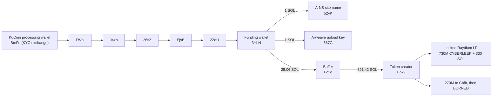

# Crypto: tracing the money

Passive on-chain analysis of the money behind the CyberLeek leak operation on
Solana. Two different things carry the CyberLeek name. This section is about the
one with the real money (the leak site and its live token), and it separates that
from a copycat token that went nowhere.

Credit where it is due: the funding-to-exchange trace was first published by
GTAForums user [**Vice Cit**](https://gtaforums.com/topic/994376-spoilers-gta-vi-leaks-analysis-thread-part-ii/page/314/#comment-1072766077). Everything below was reproduced independently from our
own on-chain pull, and the raw transactions are in
[`evidence/funding_spine/`](evidence/funding_spine/).

## Two things called CyberLeek (do not confuse them)

| | The operation (real money) | The copycat token (went nowhere) |
| --- | --- | --- |
| Token | live SPL `ApZuxdpz…` | pump.fun Token-2022 `2hRg6…pump` |
| Front | `cyber-leek.com` + Arweave leak distribution | `@cyberleeksreal` (X / Telegram), `cyberleeks.fun` |
| Funded by | one wallet (`3YLN…`) traced back to **KuCoin** | the shared Relay bridge |
| Status | locked liquidity, earning trading fees | stalled on the bonding curve |
| On-chain link between the two | **none found** | |

The rest of this section is the operation. The copycat token, and the social
persona around it, are a separate track (documented in the persona sections of
this repo). On-chain, nothing we can find connects them to the money.

## The token, and how it actually makes money

The live token (`ApZuxdpzMrbEYTGEzeY9afh5pj9d6qPRJCTgQYiipbKg`) is a classic SPL
token, about 729.95M supply, 9 decimals, and it is the contract address shown on
`cyber-leek.com`. It trades on a real Raydium market with tens of thousands of
transactions and holders.

This is not a smash-and-grab rug. The creator supplied all the original liquidity
(about 730M CYBERLEEK and 330 SOL) and **locked it** with Raydium's burn-and-earn.
Locked means they cannot pull it back out and dump it, but they still collect the
trading fee on every buy and every sell. So the operator earns from **volume**, not
from selling the token.

Per Vice Cit's fee analysis on the public Raydium data: roughly $29,000 went into
setting this up; the coin did about $15M in volume on day one (about $30,000 in
fees); total fees so far are on the order of $40,000 to $60,000, roughly $4,400 a
day at about $2.1M daily volume, for as long as interest holds. Those are estimates
from public market data, not exact figures.

That model explains the behaviour. The leaks drip out and the site runs "vote on
the next leak" polls because the point is to keep the coin **trading**, not to make
one big splash. Sustained attention is the revenue.

## The 270M burn

At creation the supply was 1,000,000,000 CYBERLEEK. 730M went into the locked pool.
The remaining **270,000,000 were sent by the creator (`Hok9…`) to a holding wallet
(`Cbfb…`), which then burned all 270,000,000** (verified on-chain, instruction type
`BURN`). That removes the dev overhang that could otherwise have crashed the price,
and it is a deliberate "this is not a rug" signal that keeps the fee machine
credible. Our token-supply reading of 729,950,775 is exactly 1B minus that burn.

## The funding spine, traced back to KuCoin

This is the identity lead. A single funding wallet paid for the whole setup, and
that wallet's SOL traces back to a regulated exchange.

- **One funding wallet (`3YLNDXnV9fNysDWaD39uQxwxeSaMFeAswvoQPZNvuNA4`) paid for all
  three pieces:** the ArNS website name (owner `52yKvgZK…`), the Arweave
  leak-upload key (`667GfnDu…`, a Solana key that also signs the Arweave uploads),
  and the token, funded through a buffer wallet (`Ec2qmcpC…`) into the creator
  (`Hok9nbV8…`). Amounts reproduced from our pull: `3YLN` sent the buffer 17.3542 +
  7.7084 SOL; the buffer sent the creator 10 + 311.42 SOL; the creator then made
  the locked pool.
- **The funding wallet traces back to KuCoin.** Six hops, all reproduced from our
  own pull on 2026-08-13: `BmFdpraQ…` (a KuCoin processing wallet) sent 100.202 SOL
  to `FWbi…`, then `FWbi → J4zo → 26sZ → EjsB → 2ZdU → 3YLN`.
- **Why it matters:** KuCoin performs identity verification, and since August 2023
  new accounts must verify a government ID. A subpoena to KuCoin for the account
  behind that deposit could return the holder's identity, transaction records, and
  session history. That is the concrete off-ledger identity target, and it is
  reachable by law enforcement.

Raw proof for every hop is in [`evidence/funding_spine/`](evidence/funding_spine/),
one `vc_tx_*.json` file per cited transaction.

## The copycat token (separate, went nowhere)

A second token carries the CyberLeek name: a Token-2022 launched on **pump.fun**
(`2hRg6EhT2Z21xKPDnzniENFbQzLazoSjwt6K26bKpump`, deployer `HhFaWEVR…`), promoted by
the `@cyberleeksreal` Telegram/X persona and the `cyberleeks.fun` domain. It stalled
on the bonding curve and never caught real money.

On-chain, this token and its deployer **do not connect to the funding spine or the
live token** in any transaction we can find. Whether it is the same operator using
separate, siloed wallets or a copycat riding the brand, no transaction links the
loud social persona to the money. The persona itself (the Telegram, the
AI-generated profile picture, the writing style, the posting rhythm) is documented
separately in this repo as its own track, and should not be read as the identity of
the money operator.

## Pay-to-vote polls: manufactured demand, paid in $CYBERLEEK

The operation's site also ran "polls" that charge the audience to take part. The
site's own rules state the mechanism:

> "Send only $CYBERLEEK to the wallet of the choice you want to vote for. Each
> dedicated wallet is checked for the configured token mint... The percentage is
> each option wallet's detected balance divided by the poll total."

So a "vote" is a transfer of $CYBERLEEK to an operator-controlled wallet, and the
poll decides which leak drops next, which pulls the next wave of trading. The polls
are a second on-chain intake and a demand-manufacturing device at once.

**The option wallets are recycled across polls, so the displayed totals are not
independent vote counts.** The same two wallets carry different, unrelated options
across polls:

| Option wallet | In the "Lucia" poll | In the "Next video" poll |
| --- | --- | --- |
| `Cpj7QARnmVR39NBGe4NWppUF7WUrWMamen4WsJNmbHQy` | "Yes Please" | "Beach" |
| `3wFKU8bzomz8eSn179JFzR4oimC3esEXxhbaWtKgJ3K3` | "Fuck No" | "Nudist Town" |
| `78BkUe4bywGhK6SJDHj5uwfyFJZ9NDG3iQ5U7rxo7QWA` | not used | "Strip Club 2" |

A wallet that is "Yes Please" in one poll and "Beach" in another is not a dedicated
ballot box. The percentages are presentation, not a tally of independent voters.

## Where the trail goes private

The public Solana data takes this to two doorways:

- **The funding side ends at KuCoin.** Past the exchange wallet the trail is inside
  KuCoin's private KYC records, reachable only by subpoena. That is the identity
  target.
- **The token side stays on-chain, but the money is not "out."** The liquidity is
  locked and the profit is a stream of trading fees, not a lump withdrawal, so there
  is no off-Solana cash-out to chase. The 270M dev allocation was burned.

## Indicators

| Type | Value |
| --- | --- |
| Live token (the operation) | `ApZuxdpzMrbEYTGEzeY9afh5pj9d6qPRJCTgQYiipbKg` |
| Funding wallet | `3YLNDXnV9fNysDWaD39uQxwxeSaMFeAswvoQPZNvuNA4` |
| Buffer wallet | `Ec2qmcpCCD9hjahAcquiQf5JkZWCK68BUahCje1izYC7` |
| Token creator | `Hok9nbV89yBSKCttxe3goqajwbiqQa9mtHvQBsbJH3Np` |
| 270M burn wallet | `CbfbaNpCGV64g2fbLBC2NXKSygeJJuC7S6i36cy8RMPo` |
| ArNS site-name wallet | `52yKvgZKczDMUNBH4V8RSNG7tn9y8SxeyTavYBZmwDHZ` |
| Arweave upload key | `667GfnDuPmamKPhPRjTfUA1nGyxg1wgP6ro4HZZ8L33D` |
| KuCoin processing wallet (funding source) | `BmFdpraQhkiDQE6SnfG5omcA1VwzqfXrwtNYBwWTymy6` |
| Copycat token (pump.fun, stalled) | `2hRg6EhT2Z21xKPDnzniENFbQzLazoSjwt6K26bKpump` |
| Copycat token deployer | `HhFaWEVRSktrUo3TnUdVrDmE6LHbkEi5rwNyR85P2GSB` |
| Poll option wallets | `Cpj7…`, `3wFK…`, `78Bk…` |

## Reproduce it

Token facts:

    curl -s https://api.mainnet-beta.solana.com -X POST -H 'content-type: application/json' \
      -d '{"jsonrpc":"2.0","id":1,"method":"getTokenSupply","params":["ApZuxdpzMrbEYTGEzeY9afh5pj9d6qPRJCTgQYiipbKg"]}'

Walk the funding wallet's history and its inbound (the last hop before it is the
KuCoin chain):

    curl -s https://api.mainnet-beta.solana.com -X POST -H 'content-type: application/json' \
      -d '{"jsonrpc":"2.0","id":1,"method":"getSignaturesForAddress","params":["3YLNDXnV9fNysDWaD39uQxwxeSaMFeAswvoQPZNvuNA4",{"limit":50}]}'

## Confidence and limits

- **Verified on-chain, reproduced from our own pull:** the funding wallet paying
  the ArNS name, the Arweave key, and the token creation; the six-hop chain from
  KuCoin to the funding wallet; the creator wallet; the 270,000,000 burn.
- **From public market data (Vice Cit's fee analysis / DexScreener):** the ~$29k
  setup, the ~$40k to $60k in fees, the daily volume and fee rate. Estimates from
  public Raydium data, not exact figures.
- **Established but off the public ledger:** the identity behind the KuCoin account
  (subpoena).
- **Retired, on purpose:** an earlier version of this section traced a bridge path
  (`7sg → relay → Unit`) and attached a ~4,186 SOL / ~$439k "cash-out" figure. On the
  complete data that path mixes wallets not tied to the operation (one never held
  the token, one was bridged-in pass-through), so it has been removed and its
  transactions moved to
  [`evidence/examined_not_attributed/`](evidence/examined_not_attributed/). The
  correction is left on the record deliberately.
- **Credit:** the funding-to-KuCoin trace was first published by GTAForums user
  [Vice Cit](https://gtaforums.com/topic/994376-spoilers-gta-vi-leaks-analysis-thread-part-ii/page/314/#comment-1072766077); we reproduced it independently.

## Evidence files (hashed)

Raw pulls plus a SHA256 manifest are in [`evidence/`](evidence/):

- `funding_spine/` - the funding wallet, buffer, creator, 270M-burn wallet, ArNS
  name wallet, Arweave key, the KuCoin processing wallet, and one raw transaction
  per cited hop (`vc_tx_*.json`).
- `raw/`, `complete_history/` - per-wallet balances, signatures, and transactions
  for the tokens and the wallets examined.
- `examined_not_attributed/` - the retired bridge-path transactions, kept for
  transparency, not as an attribution.
- `collection_log.txt`, `README_EVIDENCE.txt` - what was collected and when.
- `SHA256SUMS.txt` - SHA256 of every file (chain of custody).

Manifest SHA256: `a73dd3cd5b9c4255795cbc810b6d82253f1983b15c5d3d60d96898e5ce93a223`

Verify:

    cd evidence && sha256sum -c SHA256SUMS.txt
