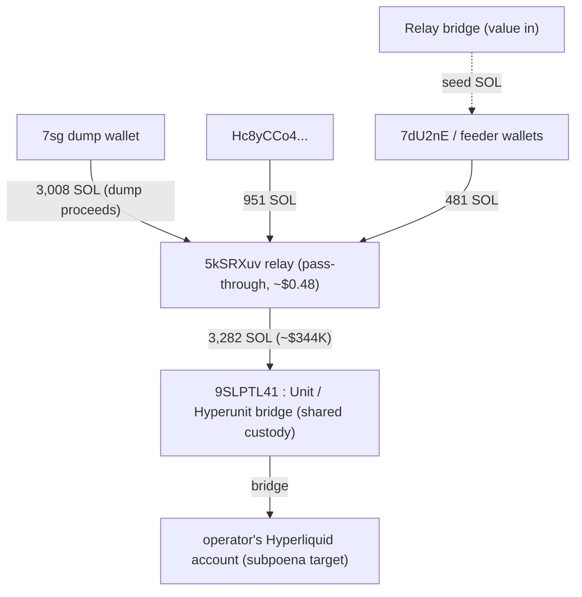

# Crypto: tracing the money

Passive on-chain analysis of the CyberLeek scam tokens on Solana, traced
from the token dump to where the proceeds leave Solana. Every address and
amount here is verifiable on a block explorer. Where the trail crosses a
bridge off Solana, this section says so and names the record-holder.

## The tokens

Two CyberLeek tokens exist. The one with real money is the one the site
points buyers at.

| Token | Address | What it is |
| --- | --- | --- |
| **CYBERLEEK (live)** | `ApZuxdpzMrbEYTGEzeY9afh5pj9d6qPRJCTgQYiipbKg` | classic SPL; \~729.95M supply; 9 decimals; the CA displayed on cyber-leek.com. Trades on Raydium: \~$681K liquidity, \~$7.5M volume, 47,800+ transactions, 61,000+ holders, \~$3.1M market cap (Solscan / DexScreener, 2026-08-28). |
| CYBERLEEKS (earlier run) | `2hRg6EhT2Z21xKPDnzniENFbQzLazoSjwt6K26bKpump` | Token-2022; 1B supply; 6 decimals; deployer `HhFaWEVRSktrUo3TnUdVrDmE6LHbkEi5rwNyR85P2GSB` (created 2026-08-25T06:33:48Z), itself funded via the Relay bridge. Low activity. |

The advertised "$17M market cap" on the site is nominal (supply x price).
The real, tradeable money is the Raydium liquidity behind the live token.

## The mechanism: free allocation, dumped

The operator holds token supply at cost basis zero (creator / team
allocation) and sells it into the pool that real buyers are filling. The
on-chain signature is unmistakable on the token's top traders: **wallets
that sold a large amount having bought nothing.**

- `7sgG1Dsk84fgia5ewkhd8RfFymk64ETBVxs72Pzc2zDW` - **sold \~$174K** (10.7M
  tokens over 62 sells), **bought $0**.
- `EfVhmasWL89KnqkNdHJ2TK3YC31aWMwU1vWR4Yb3SreE` - sold \~$93.6K, bought $0.
- A cluster of further "sold, never bought" wallets appears in the token's
  top-trader list and as connected groups on a holder bubble map,
  consistent with a coordinated bundle rather than organic sellers.

A wallet cannot sell 10.7M tokens it never bought unless it was handed them
at creation. That is the dump.

## The cash-out, traced on-chain to the bridge

The dump proceeds converge through a relay and cross into Hyperliquid via
the Unit ("Hyperunit") bridge. Every hop is a plain SOL transfer, labelled
on Solscan:

- **Relay:** `5kSRXuvcdkmuDUdUbJnCakwxZithtY1SnEs6S5SpVKeA` - 16
  transactions total, holds \~$0.48. Every amount in is forwarded out
  near-instantly (e.g. in 289.68 -> out 289.67). A pass-through layering
  wallet, not a store of value.
- **Bridge:** `9SLPTL41SPsYkgdsMzdfJsxymEANKr5bYoBsQzJyKpKS` - Solscan
  labels it **"Hyperunit: Hot Wallet"**; it holds \~348,043 SOL (\~$36.5M)
  across 1,000+ transactions. This is the **Unit bridge's shared custody
  hot wallet**, the deposit endpoint that moves native SOL onto Hyperliquid.

**\~3,282 SOL (\~$344K)** moved through this single path to the Unit bridge.
The relay was fed by the `7sg` dump wallet (\~3,008 SOL of dump proceeds),
`Hc8yCCo4...` (951 SOL), and `7dU2nE...` (481 SOL).

The inbound side runs a second bridge. The wallets were seeded through
**Relay**: its solver `F7p3dFrjRTbtRp8FRF6qHLomXbKRBzpvBLjtQcfcgmNe` funded
`7dU2nE`, the second dump wallet `EfVhmasW...`, and the token deployer. So the
operation runs value **in through Relay** and **out through Unit** into
Hyperliquid.

`EfVhmasWL89KnqkNdHJ2TK3YC31aWMwU1vWR4Yb3SreE` is a second dump wallet (sold
\~$93.6K, bought $0) funded the same way. Its full outflow is not traced here.

## Where the Solana trail ends, and the real subpoena targets

Be precise about the boundary, because it is where an outside trace has to
stop honestly:

- **`9SLPTL41` is not the operator.** Its \~$36.5M balance is the Unit
  bridge's pooled custody for all its users, exactly like a shared exchange
  hot wallet. We do not attribute it to anyone.
- **The deposit credits the operator's Hyperliquid account.** Unit records
  which account a given Solana deposit is bridged to, and Hyperliquid
  records what that account then does. Those two records tie the \~$344K to
  a specific Hyperliquid account.
- **Subpoena targets:** the **Unit bridge** (deposit-to-account mapping) and
  **Hyperliquid** (account activity and any onward withdrawal to a fiat
  exchange). Both are concrete and both are off the public Solana ledger.

The money bridged into Hyperliquid, and the record of whose account it is sits with
Unit and Hyperliquid.

## Indicators

| Type | Value |
| --- | --- |
| Live token (CYBERLEEK, SPL) | `ApZuxdpzMrbEYTGEzeY9afh5pj9d6qPRJCTgQYiipbKg` |
| Earlier token (Token-2022) | `2hRg6EhT2Z21xKPDnzniENFbQzLazoSjwt6K26bKpump` |
| Token-2022 deployer | `HhFaWEVRSktrUo3TnUdVrDmE6LHbkEi5rwNyR85P2GSB` |
| Dump wallet (sold big, bought $0) | `7sgG1Dsk84fgia5ewkhd8RfFymk64ETBVxs72Pzc2zDW` |
| Dump wallet (sold big, bought $0) | `EfVhmasWL89KnqkNdHJ2TK3YC31aWMwU1vWR4Yb3SreE` |
| Relay / layering wallet | `5kSRXuvcdkmuDUdUbJnCakwxZithtY1SnEs6S5SpVKeA` |
| Unit bridge hot wallet (shared infra) | `9SLPTL41SPsYkgdsMzdfJsxymEANKr5bYoBsQzJyKpKS` |
| Bridge / destination venue | Unit ("Hyperunit") -> Hyperliquid |

## Reproduce it

Token facts (supply, decimals, program owner):

    curl -s https://api.mainnet-beta.solana.com -X POST -H 'content-type: application/json' \
      -d '{"jsonrpc":"2.0","id":1,"method":"getTokenSupply","params":["ApZuxdpzMrbEYTGEzeY9afh5pj9d6qPRJCTgQYiipbKg"]}'

Follow a dump wallet's SOL to the relay and the bridge (parse `transfer`
instructions from each `getTransaction`):

    curl -s https://api.mainnet-beta.solana.com -X POST -H 'content-type: application/json' \
      -d '{"jsonrpc":"2.0","id":1,"method":"getSignaturesForAddress","params":["5kSRXuvcdkmuDUdUbJnCakwxZithtY1SnEs6S5SpVKeA",{"limit":30}]}'

Top traders (the "sold big, bought nothing" signature) are read from the
token's Raydium market on DexScreener / Solscan.

## Confidence and limits

- **Verified on-chain / on public explorers:** the two tokens and their
  parameters; the dump-wallet signature (large sells, zero buys); the
  relay; the bridge destination and its label; and the \~3,282 SOL amount.
- **Established but off the public Solana ledger:** the identity of the
  operator's Hyperliquid account and any onward cash-out to fiat. These
  live in Unit's and Hyperliquid's records, which is why they are
  named as subpoena targets.

## Evidence files (hashed)

Raw Solana pulls for every address in this section, plus a SHA256 manifest,
are in [`evidence/`](evidence/):

- `raw/token_*.json` - supply and account info for both tokens
- `raw/dump_*.json`, `raw/relay_*.json`, `raw/paymaster_*.json`,
  `raw/feeder_*.json`, `raw/funder_*.json`, `raw/deployer_*.json`,
  `raw/bridge_*.json` - balance, signatures, and raw transactions for each
  hop in the trail
- `collection_log.txt` - timestamped log of every fetch
- `SHA256SUMS.txt` - SHA256 of every file (chain of custody)

Manifest SHA256: `929aefad99c295134d12fb03f6fa77bdc306b03901bcb0db3cc977810cecb789`

Verify:

    cd evidence && sha256sum -c SHA256SUMS.txt
