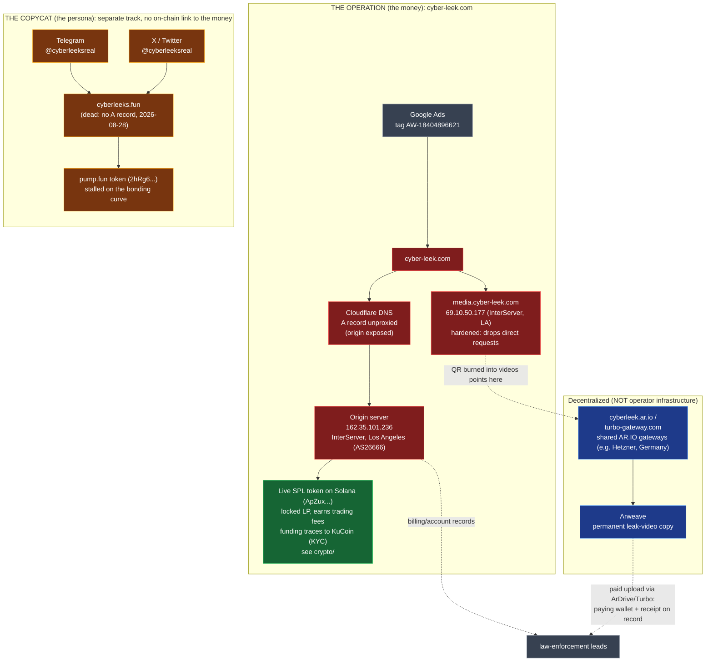

# Infrastructure

Hosting, DNS, certificates, media delivery, and how the operation is
wired end to end.

> **Two fronts.** This maps the wiring of the money operation
> (`cyber-leek.com`, its media host, and the Arweave leak distribution) and,
> the **copycat's** now-dead `cyberleeks.fun` domain. `cyber-leek.com` is the
> operation; `cyberleeks.fun` is the copycat persona. They are
> two separate tracks; see the repo root.

*Live front page of `cyber-leek.com`: the token contract address
(`ApZuxdpzMrbEYTGEzeY9afh5pj9d6qPRJCTgQYiipbKg`, the SPL "site CA" in the
on-chain table below), a "BUY NOW AND GET 50% FREE" marquee, and a paid
"GTA6 TEST PLAY ... ONLY 499$" offer. Archived: https://archive.ph/cpbHi*

## In plain terms

A website is not a magic cloud thing. It is a set of files sitting on a
computer that stays switched on and connected to the internet around the
clock. That always-on computer is called a **server**. Almost nobody buys a
whole physical machine to do this; they rent one. The common, cheap way to
rent is a **VPS (Virtual Private Server)**: one powerful physical computer in
a data center is divided into many independent virtual ones, and you rent a
slice by the month and control it remotely over the internet. Think of
renting one apartment in a large building instead of buying the whole
building. CyberLeek's website runs on rented servers at a hosting company
called **InterServer**, in Los Angeles.

Every server has an **IP address**, a string of numbers like `162.35.101.236`
that is its location on the internet, the way a street address locates a
house. People do not type numbers, so we use names like `cyber-leek.com`
instead. The service that translates the name into the number is **DNS (the
Domain Name System)**, the internet's phone book.

Here is why any of this matters. A careful operator hides his server's real
IP address behind a shield service (a well-known one is **Cloudflare**), which
sits in front of the real machine like a receptionist, so outsiders only ever
see the shield and never the computer behind it. CyberLeek uses Cloudflare for
the phone-book (DNS) part but never switched the shield on, so the real server
address is exposed. That is a serious mistake: it points anyone, law
enforcement included, straight at the actual rented computer. The leak videos
are served from a second rented server and also copied onto **Arweave** (a
decentralized "permanent" storage network that is hard to take down), and the
whole operation is advertised through **Google Ads**.

The bottom line for a non-technical reader: the operator tried hard to stay
hidden, but every layer here, the servers, the domain name, the ad account,
the video storage, is rented or bought from a real company that keeps a
billing record tied to whoever paid for it. He hid from the public, not from law
enforcement.

## Infrastructure indicators

### Web and delivery

| Indicator | Value | Notes |
| --- | --- | --- |
| Primary domain | `cyber-leek.com` | resolves **directly** to the origin (Cloudflare DNS, but the A record is unproxied - no CDN masking the origin) |
| Origin server IP | `162.35.101.236` | InterServer, Inc - AS26666 - Los Angeles, US |
| Media subdomain (video delivery) | `media.cyber-leek.com` | resolves to `69.10.50.177` (2nd InterServer IP) |
| Media server IP | `69.10.50.177` | InterServer, Inc - AS26666 - Los Angeles, US |
| Copycat domain | `cyberleeks.fun` | the **copycat persona's** site, pushed by @cyberleeksreal (archived: https://archive.ph/rYIMI); no A record as of 2026-08-28 |
| Arweave gateway (QR target) | `cyberleek.ar.io` | permaweb copy of the branded leak distribution |
| Fallback gateway | `cyberleek.turbo-gateway.com` | printed on the in-video QR ("if blocked, change gateway") |

### Tracking and paid acquisition

| Indicator | Value |
| --- | --- |
| Google Ads tag ID | `AW-18404896621` |
| gtag loader (in page source) | `https://www.googletagmanager.com/gtag/js?id=AW-18404896621` (archived: https://archive.ph/oPlW4) |

### On-chain: which mint is which

Two different token mints carry the CyberLeek name, on different token programs.
They do not connect on-chain, and keeping them straight is the whole point of the
split:

- **The operation (the money):** the classic SPL token `ApZux...`, the contract
  address shown on `cyber-leek.com`. Locked liquidity, trading-fee income, funding
  traced back to KuCoin (see [`crypto/`](../crypto/)).
- **The copycat (the persona):** the pump.fun Token-2022 `2hRg6...`, pushed by the
  `@cyberleeksreal` persona. It stalled and never caught real money.

| Track | Indicator | Value | Notes |
| --- | --- | --- | --- |
| **Operation** | Live token (site CA) | `ApZuxdpzMrbEYTGEzeY9afh5pj9d6qPRJCTgQYiipbKg` | The money. Classic SPL, \~729.95M supply, 9 decimals; the CA displayed on `cyber-leek.com`; locked LP plus trading fees; funding traces to KuCoin. Verified on Solscan (re-pull 2026-08-28). |
| **Copycat** | Persona token | `2hRg6EhT2Z21xKPDnzniENFbQzLazoSjwt6K26bKpump` | The persona. Token-2022 "Cyber Leeks Real" / CYBERLEEKS, 1,000,000,000 supply, 6 decimals, authority renounced; launched on pump.fun, pushed by `@cyberleeksreal`, stalled. Verified on Solscan. |
| **Copycat** | Persona token deployer | `HhFaWEVRSktrUo3TnUdVrDmE6LHbkEi5rwNyR85P2GSB` | Persona side. Fee payer on the CYBERLEEKS mint-creation tx (2026-08-25T06:33:48Z). |
| **Copycat** | Deployer funding (bridge-in) | Relay solver `F7p3dFrjRTbtRp8FRF6qHLomXbKRBzpvBLjtQcfcgmNe` | Persona side. A cross-chain bridge-in that seeded the copycat deployer; shared bridge infrastructure, not the operator, and not linked on-chain to the operation token. |
| Both | Trading venues referenced | pump.fun, Raydium, Jupiter, DexScreener | linked from `cyber-leek.com` |

### DNS and certificates

- `cyber-leek.com` nameservers: `crystal.ns.cloudflare.com`, `nash.ns.cloudflare.com` (Cloudflare DNS)
- `cyber-leek.com` A record: `162.35.101.236` (InterServer, Los Angeles) - **unproxied (DNS-only)**. Cloudflare runs the domain's DNS, but the record is not proxied, so it returns the raw origin IP instead of a Cloudflare edge address. The origin is exposed regardless.
- `cyberleeks.fun`: as of **2026-08-28** returns **no A record** (does not resolve); nameservers on NS1 (`dns1`-`dns4.p03.nsone.net`). Archived while live: https://archive.ph/rYIMI
- **As of 2026-08-29 (independent re-pull):** all three domains return **HTTP 000 (no response): the site is down.** DNS still resolves `cyber-leek.com` and `media.cyber-leek.com` to the same InterServer IPs (`162.35.101.236`, `69.10.50.177`), whose reverse DNS is `vps3572431.trouble-free.net` and `vps3577375.trouble-free.net` (InterServer VPS instances; `trouble-free.net` is InterServer's hosting domain). DNS records outlive a stopped server, and the InterServer hosting account behind those IPs stays the seizable record. `cyberleeks.fun` still returns no A record.
- TLS: Let's Encrypt, first certificate issued **2026-08-24** (Certificate Transparency). This is when HTTPS was switched on, a **lower bound**, not proof of when the domain was registered or the site first served. The clearnet `cyber-leek.com` could have existed earlier over plain HTTP, and the operation's on-chain setup began on **2026-08-13** (see the timeline in the repo root).
- **Domain registrar and registration date: not yet pulled.** Run [`recon/recon-operation.sh`](recon/recon-operation.sh) (RDAP + WHOIS) to obtain the registrar, the registrant account holder, and the true creation date for `cyber-leek.com`; run [`recon/recon-copycat.sh`](recon/recon-copycat.sh) for `cyberleeks.fun`. This is the open gap that fixes the standup date.

Raw lookups:

- [`recon/dns-cert-recon.txt`](recon/dns-cert-recon.txt) - first collection (2026-08-27); carries the Certificate Transparency cert data.
- [`recon/infra-recon-2026-08-28.txt`](recon/infra-recon-2026-08-28.txt) - passive re-verification (2026-08-28), SHA256 `818797eacad3da336e06112bf1cf23e4343ba084d65bc4e2bf5c4f9a99ee5ce7`; this pull surfaced the Cloudflare DNS change and `cyberleeks.fun` going dark.
- [`recon/infra-recon-2026-08-29.txt`](recon/infra-recon-2026-08-29.txt) - independent re-pull (2026-08-29), SHA256 `3b454ba800c47d109ea555c687051153125b13fcf56a4f5987841a1edeb1ec85`; confirmed the site down (HTTP 000 on all three domains) with DNS still resolving to the same InterServer IPs, and surfaced the reverse-DNS hostnames.

Two passive recon scripts, split by target, refresh the data (each adds an RDAP + WHOIS registrar lookup):

- [`recon/recon-operation.sh`](recon/recon-operation.sh) - the real operation: `cyber-leek.com` and `media.cyber-leek.com`. Writes `operation-recon-<date>.txt`.
- [`recon/recon-copycat.sh`](recon/recon-copycat.sh) - the copycat persona: `cyberleeks.fun`. Writes `copycat-recon-<date>.txt`.

### Media delivery and anti-recon

The leak videos were served from a separate host that refused direct access while the site was live:

- **Media host:** `media.cyber-leek.com` resolves to `69.10.50.177` (InterServer, Los Angeles, AS26666) - a second InterServer IP, distinct from the main site at `162.35.101.236`.
- **Direct access, while the site was live.** Through the 2026-08-28 pull, while `cyber-leek.com` was serving, HTTPS requests to the media host from an external, non-browser client got no HTTP response at all (connection dropped, `curl` code `000`) rather than content, and the origin rate-limited non-browser requests. The videos were reachable only through the site's own flow. As of **2026-08-29 the site is down** (see the DNS status note above): the domains still resolve, but nothing is served, so this can no longer be re-pulled and a `000` now means offline, not active filtering.
- **Takedown-resistant distribution.** The circulated leak video's QR points at Arweave (`cyberleek.ar.io`) and prints a fallback gateway (`cyberleek.turbo-gateway.com`) with "if blocked, change gateway." The content lives on Arweave (permanent, decentralized), so blocking one gateway does not remove it.

Net: the origin IP was exposed the whole time it was up, and the leak video also sits on Arweave with gateway failover, so no single takedown removes it. The site being down now undoes neither: the InterServer account behind the IPs and the Arweave upload receipt are still on record.

### How the leak video is distributed (Arweave, gateways, and the QR)

The leak video is delivered two ways at once: from the operator's own
server, and from a permanent, decentralized copy on Arweave. The second
path is built to survive takedowns, so it is worth stating plainly.

- **Content-addressing, not location.** A normal web link points at a
  place (a server, a folder, a file); take the server down and the link
  dies. Arweave addresses a file by its content instead. An upload gets a
  permanent ID derived from the file itself, and the data is replicated
  across a decentralized network of storage nodes paid once to keep it
  permanently. This is the "permaweb": there is no single host to seize.
- **Gateways are interchangeable doors.** A browser speaks HTTP, not
  Arweave, so a gateway sits in the middle: it takes an ordinary HTTPS
  request, fetches the content from Arweave, and returns it as a normal
  web response. Any gateway returns the identical file, because the file
  is addressed by its content. A gateway is a read path, not the file.
  `cyberleek.ar.io` and `cyberleek.turbo-gateway.com` are two different
  gateways pointing at the same underlying Arweave content.
- **The QR ties it together.** The circulated leak video has a QR burned
  into the frames, so it travels with every re-upload instead of living
  in a caption that can be stripped. The QR points at the Arweave copy,
  not the operator's own host, and the video prints a fallback gateway
  with "if blocked, change gateway." Because the content is permanent and
  gateways are swappable, blocking or removing one gateway does not remove
  the video; the viewer just routes through another door to the same file.
- **Why it still points back at him.** The resilience protects the
  content, not the operator. Permanent storage on Arweave is paid for at
  upload, through a wallet, leaving a receipt (paying wallet plus upload
  transaction, on record via ArDrive / Turbo). The one durable thing built
  to be un-takedownable, the permanent upload the QR points at, is exactly
  the thing that was paid for, and that payment is traceable.

### A note on the Arweave gateway IPs (not the operator's host)

`cyberleek.ar.io` resolves to servers on the public AR.IO gateway network
(for example, Hetzner-hosted gateway nodes in Germany). **These are not
the operator's infrastructure, and they are not where the site is
hosted.** An `.ar.io` name is served by whichever gateway node answers
for it, and a single node serves thousands of unrelated names. Three
things confirm this is shared gateway infrastructure, not an operator
server:

- The TLS certificate on that endpoint is a wildcard for the **gateway
  operator's** own domain (`*.ar.io`), not for CyberLeek.
- The endpoint applies **its own** access policy - it returned HTTP `451`
  (Unavailable For Legal Reasons) for this name, which an operator does
  not do to his own content.
- The branded media itself lives on **Arweave**, content-addressed and
  permanent. The gateway is only one interchangeable read path to it,
  which is exactly why the in-video QR says "if blocked, change gateway."

The operator's own, seizable host is the InterServer origin in Los
Angeles (`162.35.101.236`). Gateway IPs are not attributed to the
operator anywhere in this repo.

## How it is wired (two tracks, and where each breaks)

The stack at a glance, split by track. Red is the operation's own, seizable
infrastructure behind `cyber-leek.com` (every box keeps billing or account
records). Amber is the copycat persona's separate front (the `@cyberleeksreal`
Telegram and X accounts, the `cyberleeks.fun` domain, and the stalled pump.fun
token); on-chain it does not connect to the money. Blue is shared decentralized
infrastructure that is nobody's to seize; green is the live token where the
money is made. The Google ad account drives traffic to the operation; the
Telegram and X accounts belong to the copycat.

The operation is deliberately layered so that no single public lookup
exposes the operator. That same layering is its weakness: every layer is
run by a real company that keeps billing and account records.

**Front to back:**

1. **Paid traffic.** Google Ads (tag `AW-18404896621`) drives victims to the site. Google holds the advertiser's billing identity.
2. **Front door.** `cyber-leek.com` resolves **directly** to `162.35.101.236`, an InterServer server in Los Angeles (AS26666). Cloudflare handles the domain's DNS, but the record is unproxied, so the host IP is exposed. The domain registrar holds the registrant account.
3. **Origin host.** InterServer (US) runs that server and holds the hosting account and payment method behind it.
4. **Content distribution.** The leak videos are served from a second InterServer host (`media.cyber-leek.com`, `69.10.50.177`) that refuses direct requests, and are mirrored on Arweave (`cyberleek.ar.io`, `turbo-gateway` fallback) via ArDrive / Turbo - the Arweave uploads are paid for, with the paying wallet and receipt on record.
5. **The token.** The live `$CYBERLEEK` is a classic SPL token with locked Raydium liquidity, traded on Raydium / Jupiter and tracked on DexScreener. A separate pump.fun token of the same name (the persona's) stalled and is not part of this operation.
6. **The money.** The token's liquidity is locked (Raydium burn-and-earn) and the operation earns the trading fee on every trade; the 270M dev allocation was burned. The whole setup was paid for by one funding wallet whose SOL traces back six hops to a KuCoin (KYC) account, the identity lead. See [`crypto/`](../crypto/).

**Why it's hard to track from the outside:**

- Arweave is decentralized and permanent - no host to lean on, no simple owner lookup.
- The proceeds never leave in a lump. The liquidity is locked and the operator earns a trading fee on every trade, so there is no single off-Solana cash-out to chase. The identity lead is on the funding side (KuCoin), not on a payout.

**Why it's still reachable - the companies in the middle:**

Every layer is operated by an identifiable company that keeps records tying it to a paying account:

- **Google** - the Ads billing identity behind the operation's own ad account (tag `AW-18404896621`, loaded on `cyber-leek.com`; archived: https://archive.ph/oPlW4)
- The **domain registrar** and **Cloudflare** - the registrant / DNS account behind the domains
- **InterServer** (origin host, `162.35.101.236`, AS26666) - the server account and payment method
- **ArDrive / Turbo** - the wallet and receipt that paid for the Arweave uploads
- **KuCoin** - the KYC exchange the setup funding traces back to, six hops from the funding wallet; the account records behind that deposit are the identity lead, reachable through KuCoin's law-enforcement request process (MLAT for the Seychelles entity). See [`crypto/`](../crypto/) for the KYC detail and sources.
- **Raydium** - the locked-liquidity market the operation earns its fees from; on-chain and public, but the income is a fee stream, not a withdrawal to chase

None of these are reachable by a researcher from the outside. All of them
are reachable by law enforcement with a records request. The public
evidence in this repo is what points a records request at the right company.
