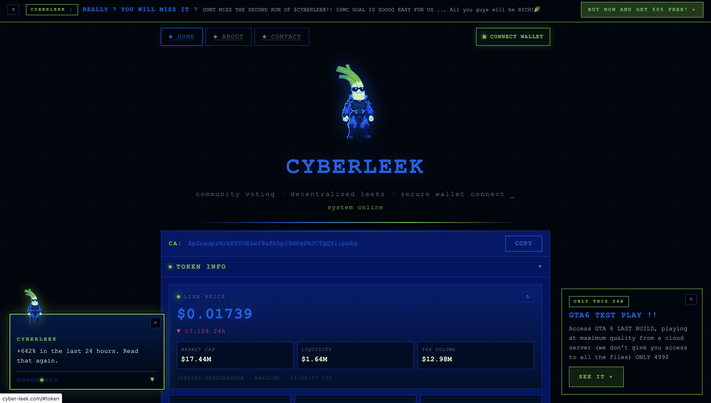
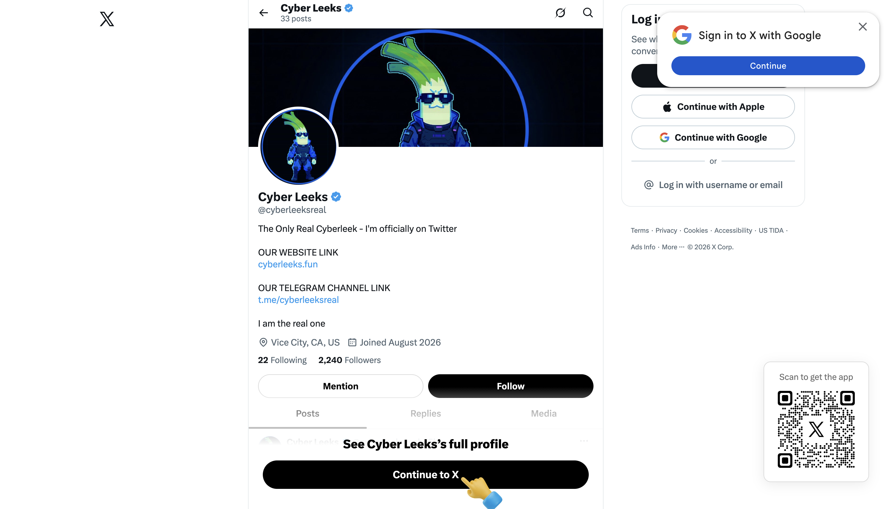

# Infrastructure

Hosting, DNS, certificates, media delivery, and how the operation is
wired end to end.

*Live front page of `cyber-leek.com`: the token contract address
(`ApZuxdpzMrbEYTGEzeY9afh5pj9d6qPRJCTgQYiipbKg`, the SPL "site CA" in the
on-chain table below), a "BUY NOW AND GET 50% FREE" marquee, and a paid
"GTA6 TEST PLAY ... ONLY 499$" offer. Archived: https://archive.ph/cpbHi*

## Infrastructure indicators

### Web and delivery

| Indicator | Value | Notes |
| --- | --- | --- |
| Primary domain | `cyber-leek.com` | resolves **directly** to the origin (Cloudflare DNS, but the A record is unproxied - no CDN masking the origin) |
| Origin server IP | `162.35.101.236` | InterServer, Inc - AS26666 - Los Angeles, US |
| Media subdomain (video delivery) | `media.cyber-leek.com` | resolves to `69.10.50.177` (2nd InterServer IP) |
| Media server IP | `69.10.50.177` | InterServer, Inc - AS26666 - Los Angeles, US |
| Secondary domain | `cyberleeks.fun` | advertised as the official site by @cyberleeksreal (archived: https://archive.ph/rYIMI); no A record as of 2026-08-28 |
| Arweave gateway (QR target) | `cyberleek.ar.io` | permaweb copy of the branded leak distribution |
| Fallback gateway | `cyberleek.turbo-gateway.com` | printed on the in-video QR ("if blocked, change gateway") |

### Tracking and paid acquisition

| Indicator | Value |
| --- | --- |
| Google Ads tag ID | `AW-18404896621` |
| gtag loader (in page source) | `https://www.googletagmanager.com/gtag/js?id=AW-18404896621` (archived: https://archive.ph/oPlW4) |

### On-chain

Two distinct CyberLeek token mints exist - different token programs,
decimals, and activity windows - consistent with the site's advertised
"second run of \$CYBERLEEK". The site currently displays `ApZux...`; the
money trace in [`crypto/`](../crypto/) references `2hRg6...`.

| Indicator | Value | Notes |
| --- | --- | --- |
| Token mint - CYBERLEEKS | `2hRg6EhT2Z21xKPDnzniENFbQzLazoSjwt6K26bKpump` | Token-2022; "Cyber Leeks Real" / CYBERLEEKS; 6 decimals; mint+freeze authority renounced; metadata `ipfs://bafkreicdk2et...`; last activity 2026-08-26 |
| Token mint - site CA | `ApZuxdpzMrbEYTGEzeY9afh5pj9d6qPRJCTgQYiipbKg` | classic SPL Token; 9 decimals; ~730M supply; authorities renounced; last activity 2026-08-27; the CA currently shown on cyber-leek.com |
| Trading venues referenced | pump.fun, Raydium, Jupiter, DexScreener | linked from the site |
| ETH cash-out wallets | `0xbb22f5c5e6e3086c248d80929b03b157a90381a8`, `0x8bEe4D7bDaa37fb57aAC98cA9B50fF52117123A0` | see crypto/ |
| Token deployer wallet | `HhFaWEVRSktrUo3TnUdVrDmE6LHbkEi5rwNyR85P2GSB` | fee payer on the CYBERLEEKS mint-creation tx (2026-08-25T06:33:48Z) |
| Swap service order ref | `03772c77` | SOL to ETH |

### DNS and certificates

- `cyber-leek.com` nameservers: `crystal.ns.cloudflare.com`, `nash.ns.cloudflare.com` (Cloudflare DNS)
- `cyber-leek.com` A record: `162.35.101.236` (InterServer, Los Angeles) - **unproxied (DNS-only)**. Cloudflare runs the domain's DNS, but the record is not proxied, so it returns the raw origin IP instead of a Cloudflare edge address. The origin is exposed regardless.
- `cyberleeks.fun`: as of **2026-08-28** returns **no A record** (does not resolve); nameservers on NS1 (`dns1`-`dns4.p03.nsone.net`). Archived while live: https://archive.ph/rYIMI
- TLS: Let's Encrypt, first certificate issued **2026-08-24** (Certificate Transparency) - the site was stood up around that date

Raw lookups:

- [`recon/dns-cert-recon.txt`](recon/dns-cert-recon.txt) - first collection, 2026-08-27.
- [`recon/infra-recon-2026-08-28.txt`](recon/infra-recon-2026-08-28.txt) - passive re-verification, 2026-08-28T04:32Z. SHA256 `818797eacad3da336e06112bf1cf23e4343ba084d65bc4e2bf5c4f9a99ee5ce7` (the collector's own host IP was redacted from line 3; all target data is intact). This pull is what surfaced the Cloudflare-DNS change and `cyberleeks.fun` going dark.

### Media delivery and anti-recon

The leak videos are served from a separate host, hardened against direct access:

- **Media host:** `media.cyber-leek.com` resolves to `69.10.50.177` (InterServer, Los Angeles, AS26666) - a second InterServer IP, distinct from the main site at `162.35.101.236`.
- **Direct access is blocked.** HTTPS requests to the media host from an external server return no HTTP response at all (connection dropped, `curl` code `000`) instead of content. The endpoint does not serve direct or enumeration requests; the videos are only reachable through the site's own flow. (Re-confirmed on the 2026-08-28 pull: both the main origin and the media host dropped the connection to a non-browser request.)
- **Takedown-resistant distribution.** The circulated leak video's QR points at Arweave (`cyberleek.ar.io`) and prints a fallback gateway (`cyberleek.turbo-gateway.com`) with "if blocked, change gateway." The content lives on Arweave (permanent, decentralized), so blocking one gateway does not remove it.

Net: the main origin IP is exposed, but the media path is deliberately defended - a separate host that drops direct connections, plus a permaweb copy with gateway failover.

### A note on the Arweave gateway IPs (not the operator's host)

`cyberleek.ar.io` resolves to servers on the public AR.IO gateway network
(for example, Hetzner-hosted gateway nodes in Germany). **These are not
the operator's infrastructure, and they are not where the site is
hosted.** An `.ar.io` name is served by whichever gateway node answers
for it, and a single node serves thousands of unrelated names. Three
things confirm this is shared gateway infrastructure, not an operator
server:

- The TLS certificate on that endpoint is a wildcard for the **gateway
  operator's** own domain (`*.ar.io`), not for CyberLeek.
- The endpoint applies **its own** access policy - it returned HTTP `451`
  (Unavailable For Legal Reasons) for this name, which an operator does
  not do to his own content.
- The branded media itself lives on **Arweave**, content-addressed and
  permanent. The gateway is only one interchangeable read path to it,
  which is exactly why the in-video QR says "if blocked, change gateway."

The operator's own, seizable host is the InterServer origin in Los
Angeles (`162.35.101.236`). Gateway IPs are not attributed to the
operator anywhere in this repo.

*The operation's verified X account, `@cyberleeksreal` ("The Only Real Cyberleek"), linking `cyberleeks.fun` and the Telegram channel `t.me/cyberleeksreal`. Listed location: "Vice City, CA, US".*

## How the operation is wired (and where it breaks)

The operation is deliberately layered so that no single public lookup
exposes the operator. That same layering is its weakness: every layer is
run by a real company that keeps billing and account records.

**Front to back:**

1. **Paid traffic.** Google Ads (tag `AW-18404896621`) drives victims to the site. Google holds the advertiser's billing identity.
2. **Front door.** `cyber-leek.com` resolves **directly** to `162.35.101.236`, an InterServer server in Los Angeles (AS26666). Cloudflare handles the domain's DNS, but the record is unproxied, so the host IP is exposed. The domain registrar holds the registrant account.
3. **Origin host.** InterServer (US) runs that server and holds the hosting account and payment method behind it.
4. **Content distribution.** The leak videos are served from a second InterServer host (`media.cyber-leek.com`, `69.10.50.177`) that refuses direct requests, and are mirrored on Arweave (`cyberleek.ar.io`, `turbo-gateway` fallback) via ArDrive / Turbo - the Arweave uploads are paid for, with the paying wallet and receipt on record.
5. **The token.** Launched on pump.fun (Solana), traded on Raydium / Jupiter, tracked on DexScreener.
6. **The money.** Collected on Solana, peeled through intermediate wallets, swapped to ETH (order `03772c77`), bridged to Base, into shared custodial payment infrastructure. See [`crypto/`](../crypto/).

**Why it's hard to track from the outside:**

- Arweave is decentralized and permanent - no host to lean on, no simple owner lookup.
- The crypto uses a peel chain, a cross-chain swap, and a bridge into shared payment rails, so the funds blend with unrelated traffic and the public trail goes cold.

**Why it's still reachable - the companies in the middle:**

Every layer is operated by an identifiable company that keeps records tying it to a paying account:

- **Google** - Ads billing, and the signed-in Google account behind the operator's browser (see [`browser/`](../browser/))
- The **domain registrar** and **Cloudflare** - the registrant / DNS account behind the domains
- **InterServer** (origin host, `162.35.101.236`, AS26666) - the server account and payment method
- **ArDrive / Turbo** - the wallet and receipt that paid for the Arweave uploads
- **pump.fun** and the **exchanges** the money touched
- The **swap service** (order `03772c77`), the **bridge**, and the **Base / Coinbase custodians** - KYC on the cash-out

None of these are reachable by a researcher from the outside. All of them
are reachable by law enforcement with a records request. The public
evidence in this repo is what points a subpoena at the right company.
