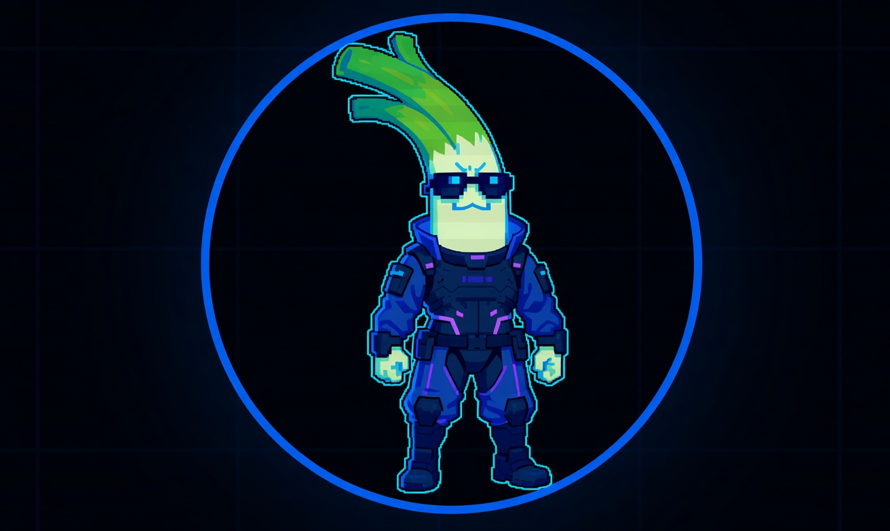

# Metadata: profile picture provenance

## In plain terms

The profile picture is not a photo, and not something an artist drew by hand.
It was produced by an **AI image generator** (software that invents a picture
from a text prompt). The important part is that the file was saved with its
**content credentials** still attached. Content credentials (an industry
standard called **C2PA**) are a tamper-evident label baked into the image that
records what created it and when, a little like the hidden data a camera writes
into a photo, but digitally signed so it is hard to fake. Reading that label
back out is how we can state the avatar is AI-made instead of guessing from how
it looks.

The image is also stored on **IPFS**, a decentralized file network where a
file's address is a **hash**: a unique fingerprint calculated from the file's
exact bytes. Because the address is derived from the contents, anyone can
re-calculate it from the downloaded file and prove they are looking at the very
same image the operator published, with nothing swapped or altered along the
way. This section walks through both checks.

## Source

The profile picture is stored on IPFS:

- `ipfs://bafkreibqtf7qdhk3sq5icul4mnbfretwn5vyvw56ask5e25symri627wn4`

IPFS addresses are content-addressed. The CID is a hash of the file
itself, so that string is both the location and the integrity check. If
the bytes change, the CID changes. The image you read the credentials
from is provably the same image the operator published.

## How we found it

Nothing here required contact with the operator or any private data. It
is all read off the published image.

**1. Pull the CID off the profile.** The avatar on the profile did not
load from the scam domain. It resolved through an IPFS gateway, which
exposes the raw CID in the image URL. That CID is the address above.

**2. Fetch the image from a gateway.** Any public gateway returns the
exact bytes for that CID:

    curl -L -o pfp.jpg \
      "https://ipfs.io/ipfs/bafkreibqtf7qdhk3sq5icul4mnbfretwn5vyvw56ask5e25symri627wn4"

**3. Confirm the file matches the CID.** Because the CID is a hash of the
content, re-deriving it from the downloaded file proves you have the same
image and nothing was swapped in transit:

    ipfs add --only-hash pfp.jpg
    # returns bafkreibqtf7qdhk3sq5icul4mnbfretwn5vyvw56ask5e25symri627wn4

**4. Read the embedded content credentials.** The image carries a C2PA
manifest. Read it directly out of the file:

    pip install c2pa-python
    python3 -c "import c2pa,sys; print(c2pa.Reader.from_file(sys.argv[1]).json())" pfp.jpg

## The finding

The C2PA manifest reads:

- **Generator (`claim_generator_info.name`):** `Grok Imagine`
  (`c2pa_rs` 0.76.2)
- **Action:** `c2pa.created`, softwareAgent `Grok Imagine`,
  `digitalSourceType = trainedAlgorithmicMedia` (declared AI-generated)
- **Creative-work author:** Organization `SpaceXAI`
- **Manifest ID:** `urn:c2pa:1bd5eb56-538d-45d1-95fe-df4f4788854f`
- **Asset / title ID:** `741ba750-f011-41c6-aa04-1be2df0647f4`
- **Instance ID:** `xmp:iid:ab4249f9-f877-4ad6-a76e-44eb5cbb9a33`
- **Signature:** Ed25519, issuer
  "Self-signed ephemeral certificate (Content Authenticity SDK) --
  LOCAL USE ONLY", common name `xAI Grok Imagine`
- **Certificate serial:** `50872080510237537`

In plain terms: the operator generated his own profile picture with
Grok Imagine and used it as-is, with the content credentials left
intact.

## What "Valid" actually means here

The reader returns `"validation_state": "Valid"`, and at the same time
it returns one failure, `signingCredential.untrusted`. These are not in
conflict, and the difference is the whole point:

- **What is cryptographically proven.** The signature checks out against
  the certificate embedded in the file, and every content hash matches
  (`claimSignature.validated`, `assertion.dataHash.match`, and each
  `assertion.hashedURI.match` all pass). That means the image has **not
  been altered since it was signed**, and the manifest genuinely belongs
  to these bytes. This is what `validation_state: Valid` reports.
- **What is not proven.** The signing certificate is **self-signed and
  untrusted** (`signingCredential.untrusted`). It does not chain to a
  trusted root, so the manifest is not hard proof that xAI itself signed
  it. It is a self-asserted credential.

The correct reading: the credential is **internally intact and
self-consistent**, and its content, generator, and "LOCAL USE ONLY"
certificate pattern are exactly what a genuine Grok Imagine export
carries by default. We treat it as a strong, reproducible indicator that
the avatar is Grok Imagine output, not as a chain-of-trust guarantee
signed by xAI. Anyone claiming this is forged would have to explain a
manifest whose hashes all match the published bytes.

## Why it matters

- **It is a durable, re-checkable signal.** The finding does not depend on
  our word for it. Anyone can pull the same CID, verify the hash, and read
  the same manifest. There is no chain-of-custody gap to argue about.
- **It ties the avatar to a specific generation workflow.** The credential
  points straight at a Grok Imagine session. That distinguishes the
  operator's own generated assets from any genuine material he reposts.
- **The "LOCAL USE ONLY" self-signed certificate** means the credential
  was not produced by a hardened publishing pipeline. It is the default
  stamp a Grok Imagine output carries. Its presence, untouched, tells you
  the operator did not strip metadata before posting, which is itself a
  small operational-hygiene tell.

## The avatar in use

*The same Grok-generated leek character is the avatar and banner on the operation's verified X account, `@cyberleeksreal` ("The Only Real Cyberleek"), which links `cyberleeks.fun` and the Telegram channel `t.me/cyberleeksreal`. Listed location "Vice City, CA, US" is a Grand Theft Auto reference, not a geolocation claim.*

## What this is and is not

- This identifies **how the image was made**, not **who made it**. A Grok
  Imagine credential does not name a person, and we make no such claim
  here.
- The `SpaceXAI` author field and `LOCAL USE ONLY` certificate are
  artifacts of the Grok Imagine tool, not a link to any real xAI or SpaceX
  account.

## Evidence

- Image CID:
  `bafkreibqtf7qdhk3sq5icul4mnbfretwn5vyvw56ask5e25symri627wn4`
- Full raw manifest: `c2pa-credentials.txt`
- SHA256 of the fetched image and archive.ph link: see
  [`../EVIDENCE.md`](../EVIDENCE.md)
