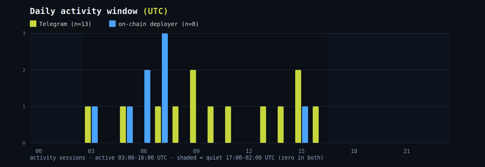
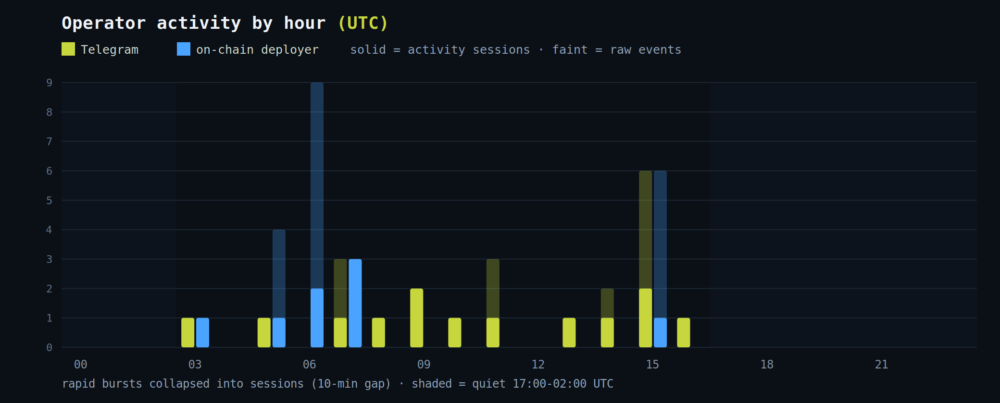

# Posting pattern and activity times

> **Which track: the persona, not the money.** This section documents the loud
> half of the case: the `@cyberleeksreal` Telegram / X account, the
> `cyberleeks.fun` domain, and a pump.fun token that stalled. On-chain, none of it
> connects to the KuCoin-funded wallets behind the live token and the leak site
> (see [`../crypto/`](../crypto/)). Whether this persona is the money operator
> keeping a loud alias walled off, or a copycat riding the brand, is unproven.
> Read what follows as observations about the persona, not an identification of
> whoever holds the money.


When the persona is active on its channels, measured from two independent
persona-side sources: the `@cyberleeksreal` Telegram channel and the pump.fun
token deployer wallet (`HhFa...`). Both belong to the copycat persona, and
neither is a wallet behind the money (the KuCoin-funded live token and leak
site; see [`../crypto/`](../crypto/)). This correlation stays entirely inside
the persona track: at most it shows the Telegram account and the pump.fun wallet
are one hand. It says nothing about who holds the money. Post and transaction
times are facts you can measure; the pattern they form is the finding.




## In plain terms

People run on habits, and scammers are no exception. If you write down the
exact time of everything the persona does in public, both its Telegram posts
and the pump.fun deployer wallet's own transactions, a daily rhythm appears: the
hours it is active, and the hours it goes dark. One catch has to be handled
first: apps show each viewer the time in their own local zone, so to compare
honestly we convert every timestamp to one shared world clock called **UTC
(Coordinated Universal Time)**, the global reference that does not shift with
location or daylight saving. Lined up in UTC, his active window and his quiet
window are consistent from day to day. That repeatable rhythm is what
investigators call a **pattern of life**. It does not name anyone, but it links
the persona's separate accounts (the Telegram and the pump.fun wallet) to one
routine. It still does not reach the money wallets, and this repo does not use
it to fix a timezone or a location.

## Sources

- **Telegram** - `t.me/cyberleeksreal` post datetimes (scraped from the public `t.me/s/` view). Raw: [`telegram-post-times.txt`](telegram-post-times.txt).
- **On-chain (persona-side)** - transactions signed by the persona's pump.fun CYBERLEEKS deployer wallet `HhFaWEVRSktrUo3TnUdVrDmE6LHbkEi5rwNyR85P2GSB` (the persona's own signed actions on its stalled token, not general token trades, and not the money wallets). Raw: [`deployer-onchain-times.txt`](deployer-onchain-times.txt).

## Method

Timestamps are parsed as timezone-aware and normalized to UTC before
binning. Activity is counted as **sessions**: events within a 10-minute
gap count once, so a rapid sequence of posts or transactions registers as
one active period rather than many. Both the raw event count and the
session count are shown below. See [`analyze_times.py`](analyze_times.py).

## Data

23 Telegram posts + 23 on-chain deployer actions. All timestamps UTC.



```
hour          TG (raw/sessions)   on-chain (raw/sessions)
03:00              1 / 1                1 / 1
05:00              1 / 1                4 / 1
06:00              1 / 1                9 / 2
07:00              3 / 1                3 / 3
08:00              1 / 1                0 / 0
09:00              2 / 2                0 / 0
10:00              1 / 1                0 / 0
11:00              3 / 1                0 / 0
13:00              1 / 1                0 / 0
14:00              2 / 1                0 / 0
15:00              6 / 2                6 / 1
16:00              1 / 1                0 / 0
17:00-02:00        0 / 0                0 / 0   (both zero)

raw events: TG 23, on-chain 23   |   sessions: TG 14, on-chain 8
```

## Finding

Both sources are active in the **03:00-16:00 UTC** band and drop to
**zero across the 17:00-02:00 UTC window** - a 10+ hour daily quiet
period that appears independently in the Telegram posts and the on-chain
deployer activity.

## A "good morning" greeting

On 2026-08-28 the channel posted a "good morning" greeting
(`t.me/cyberleeksreal/33`, archived: https://archive.ph/zkVZh):


*Post /33: "Good morning guys.. More leaks coming today." The clock a Telegram
client shows is the viewer's own local time; the collector records the post's
UTC timestamp, which lands at the early edge of the active window.*

A "good morning" greeting is different from a bare timestamp: it is a semantic
self-report of local time of day. Taken at face value it puts the persona's
local morning at the start of the active band (about 05:00-06:00 UTC), which is
consistent with the daily rhythm the two channels already show. We deliberately
stop there: this repo does not publish a location or timezone attribution. A
single greeting is weak anyway, and could be performative, scheduled, or written
by one of several people running the persona.


## What this is, and what it is not

This is a behavioral fingerprint: a repeatable active/quiet cycle that
shows up in two independent persona-side sources and can be used to correlate
the persona's Telegram with its pump.fun wallet. It does not correlate to, or
say anything about, the money wallets.

On its own, the active/quiet cycle fixes **no** timezone and **no** location,
and this repo does not attempt to place the persona geographically. The "good
morning" greeting is a self-reported local-morning marker, nothing more. The pattern does
**not** indicate whether one person or several are behind the persona. A quiet
window is not proof of sleep - scheduled posting, automation, shift work,
or multiple people running the persona in different places would all produce the same
shape. The samples span 2026-08-25 through 08-28, still a short
window.
