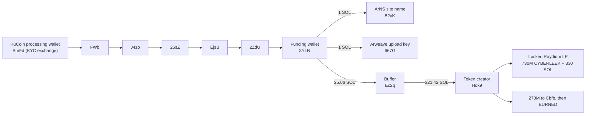

# Crypto: tracing the money

Passive on-chain analysis of the money behind the CyberLeek leak operation on
Solana. Two different things carry the CyberLeek name. This section is about the
one with the real money (the leak site and its live token), and it separates that
from a copycat token that went nowhere.

Credit: the funding-to-exchange trace was first published by GTAForums user
[Vice Cit](https://gtaforums.com/topic/994376-spoilers-gta-vi-leaks-analysis-thread-part-ii/page/314/#comment-1072766077).
Reproduced independently here; raw transactions in
[`evidence/operation/funding_spine/`](evidence/operation/funding_spine/).

## Two things called CyberLeek (do not confuse them)

| | The operation (real money) | The copycat token (went nowhere) |
| --- | --- | --- |
| Token | live SPL `ApZuxdpz…` | pump.fun Token-2022 `2hRg6…pump` |
| Front | `cyber-leek.com` + Arweave leak distribution | `@cyberleeksreal` (X / Telegram), `cyberleeks.fun` |
| Funded by | one wallet (`3YLN…`) traced back to **KuCoin** | the shared Relay bridge |
| Status | locked liquidity, earning trading fees | stalled on the bonding curve |
| On-chain link between the two | **none found** | |

The rest of this section is the operation. The copycat token, and the social
persona around it, are a separate track (documented in the persona sections of
this repo). On-chain, nothing we can find connects them to the money.

## The token, and how it actually makes money

The live token (`ApZuxdpzMrbEYTGEzeY9afh5pj9d6qPRJCTgQYiipbKg`) is a classic SPL
token, about 729.95M supply, 9 decimals, and it is the contract address shown on
`cyber-leek.com`. It trades on a real Raydium market with tens of thousands of
transactions and holders.

This is not a smash-and-grab rug. The creator supplied all the original liquidity
(about 730M CYBERLEEK and 330 SOL) and **locked it** with Raydium's burn-and-earn.
Locked means they cannot pull it back out and dump it, but they still collect the
trading fee on every buy and every sell. So the operator earns from **volume**, not
from selling the token.

Per [Vice Cit](https://gtaforums.com/topic/994376-spoilers-gta-vi-leaks-analysis-thread-part-ii/page/314/#comment-1072766077)'s fee analysis on the public Raydium data: roughly $29,000 went into
setting this up; the coin did about $15M in volume on day one (about $30,000 in
fees); total fees so far are on the order of $40,000 to $60,000, roughly $4,400 a
day at about $2.1M daily volume, for as long as interest holds. Those are estimates
from public market data, not exact figures.

That model explains the behaviour. The leaks drip out and the site runs "vote on
the next leak" polls because the point is to keep the coin **trading**, not to make
one big splash. Sustained attention is the revenue.

*The live CYBERLEEK token (`ApZux...`) on Raydium, via DexScreener. The market cap
slid from about $8M toward $1.9M (down ~54% in 24h) as holders sold, 13,202 sells
against 11,478 buys. The liquidity is locked (about $527K, note the lock icon on
the panel), so the operator cannot pull it, yet still earns the trading fee on
every one of those sells. The price dump falls on holders, not the operator: with
the dev allocation burned and the pool locked, the operator's income is the fee on
volume, whichever way the price runs. Captured 2026-08-28.*

## The 270M burn

At creation the supply was 1,000,000,000 CYBERLEEK. 730M went into the locked pool.
The remaining **270,000,000 were sent by the creator (`Hok9…`) to a holding wallet
(`Cbfb…`), which then burned all 270,000,000** (verified on-chain, instruction type
`BURN`). That removes the dev overhang that could otherwise have crashed the price,
and it is a deliberate "this is not a rug" signal that keeps the fee machine
credible. Our token-supply reading of 729,950,775 is exactly 1B minus that burn.

## The funding spine, traced back to KuCoin

This is the identity lead. A single funding wallet paid for the whole setup, and
that wallet's SOL traces back to a regulated exchange.

- **One funding wallet (`3YLNDXnV9fNysDWaD39uQxwxeSaMFeAswvoQPZNvuNA4`) paid for all
  three pieces:** the ArNS website name (owner `52yKvgZK…`), the Arweave
  leak-upload key (`667GfnDu…`, a Solana key that also signs the Arweave uploads),
  and the token, funded through a buffer wallet (`Ec2qmcpC…`) into the creator
  (`Hok9nbV8…`). Amounts reproduced from our pull: `3YLN` sent the buffer 17.3542 +
  7.7084 SOL; the buffer sent the creator 10 + 311.42 SOL; the creator then made
  the locked pool.
- **The funding wallet traces back to KuCoin.** Six hops, all reproduced from our
  own pull on 2026-08-13: `BmFdpraQ…` (a KuCoin processing wallet) sent 100.202 SOL
  to `FWbi…`, then `FWbi → J4zo → 26sZ → EjsB → 2ZdU → 3YLN`.
- **Why it matters:** the account behind that deposit has a verified real-world
  identity on file. KuCoin has required a government ID from all users since
  **July 15, 2023**, and its own policy is to answer authorized law-enforcement
  requests. That is the concrete off-ledger identity target. See **What KYC is**
  below for how that door opens, including the Seychelles / MLAT nuance.

Raw proof for every hop is in [`evidence/operation/funding_spine/`](evidence/operation/funding_spine/),
one `vc_tx_*.json` file per cited transaction.

## What KYC is, and why it is the identity lead

**KYC stands for "Know Your Customer."** It is the rule that makes a regulated
exchange verify who its users actually are: your real name, a government photo ID
(passport or driver's license), often a selfie and proof of address, before you
can trade, deposit, or withdraw. The exchange keeps that identity record on file.

Here is why that is the whole game in a trace like this. A blockchain wallet is
**pseudonymous**: it is a string of characters with no name attached. The public
ledger shows *what* moved and *where* it went, in full, forever, but never *who*
is behind the keys. On-chain analysis can follow the money across dozens of
wallets and still never reach a person. KYC is the one place the chain touches the
real world. The moment money comes **out of a KYC exchange account**, that account
has a verified human identity sitting behind it. That is why a trail that leads
*backward into* an exchange is stronger than one that leads *out to* a mixer or a
bridge: the exchange is a door with a name on the other side, not a dead end.

For this case specifically:

- **The identity exists.** KuCoin has required identity verification with a
  government ID from **all** users since **July 15, 2023** ([KuCoin identity
  verification statement](https://www.kucoin.com/announcement/en-kyc-user-identity-authentication-statement)). The account that
  funded this operation was verified under that rule, so a real identity is on
  file with the exchange.
- **KuCoin answers law enforcement, by its own written policy.** KuCoin publishes
  a [Law Enforcement Request Process](https://www.kucoin.com/legal/law-enforcement-request-guidelines) and states it will *"respond to all
  law enforcement requests from authorized law enforcement officials with proof
  of authority,"* returning account and identity records on a subpoena, court order,
  or warrant.
- **The Seychelles nuance.** KuCoin's operating entity, **Mek Global Limited**, is
  registered in the **Seychelles** (named as the defendant entity in [*People v.
  Mek Global Limited & PhoenixFin Pte Ltd d/b/a KuCoin*](https://ag.ny.gov/sites/default/files/2023.03.09_-_memorandum_of_law_-_people_v_mek_global_limited_and_phoenixfin_pte_ltd_dba_kucoin.pdf)), so a request from a foreign authority does not
  travel as a plain domestic subpoena; it goes through a **Mutual Legal Assistance
  Treaty (MLAT)**, which [KuCoin's own guidelines](https://www.kucoin.com/legal/law-enforcement-request-guidelines) require for cross-border
  requests.
- **Why it is more reachable now.** In **March 2025 [KuCoin pleaded guilty](https://www.justice.gov/usao-sdny/pr/kucoin-pleads-guilty-unlicensed-money-transmission-charge-and-agrees-pay-penalties)** in
  U.S. federal court (SDNY) to unlicensed money transmission and paid **$297.4M**, with
  ongoing compliance obligations. That plea gives U.S. authorities real leverage
  and a cooperation posture, Seychelles registration notwithstanding.

So the funding wallet's SOL leading back six hops to a KuCoin account is not a
loose thread. It is the point where a pseudonymous money trail meets a verified,
law-enforcement-reachable identity. That is the identity lead.

## The copycat token (separate, went nowhere)

A second token carries the CyberLeek name: a Token-2022 launched on **pump.fun**
(`2hRg6EhT2Z21xKPDnzniENFbQzLazoSjwt6K26bKpump`, deployer `HhFaWEVR…`), promoted by
the `@cyberleeksreal` Telegram/X persona and the `cyberleeks.fun` domain. It stalled
on the bonding curve and never caught real money.

On-chain, this token and its deployer **do not connect to the funding spine or the
live token** in any transaction we can find. Whether it is the same operator using
separate, siloed wallets or a copycat riding the brand, no transaction links the
loud social persona to the money. The persona itself (the Telegram, the
AI-generated profile picture, the writing style, the posting rhythm) is documented
separately in this repo as its own track, and should not be read as the identity of
the money operator.

## Pay-to-vote polls: manufactured demand, paid in $CYBERLEEK

The operation's site, `cyber-leek.com`, also ran "polls" that charge the audience
to take part. Both polls below are captured on that site: the "Lucia prologue"
poll (archived: https://archive.ph/A4zKG) and the "Next GTA 6 video" poll (in the
homepage snapshot, https://archive.ph/cpbHi). The site's own rules state the
mechanism:

> "Send only $CYBERLEEK to the wallet of the choice you want to vote for. Each
> dedicated wallet is checked for the configured token mint... The percentage is
> each option wallet's detected balance divided by the poll total."

So a "vote" is a transfer of $CYBERLEEK to an operator-controlled wallet, and the
poll decides which leak drops next, which pulls the next wave of trading. The polls
are a second on-chain intake and a demand-manufacturing device at once.

*The "Lucia prologue" poll on `cyber-leek.com`. "Yes Please" collects $CYBERLEEK to
`Cpj7QARn...`, "Fuck No" to `3wFKU8bz...`. Archived: https://archive.ph/A4zKG*

*The "Next GTA 6 video" poll on the same site. The identical `Cpj7QARn...` wallet is
now labelled "Beach" and `3wFKU8bz...` is "Nudist Town", with `78BkUe4b...` added as
"Strip Club 2". Same wallets, different options. Archived: https://archive.ph/cpbHi*

**The option wallets are recycled across polls, so the displayed totals are not
independent vote counts.** The same two wallets carry different, unrelated options
across polls:

| Option wallet | In the "Lucia" poll | In the "Next video" poll |
| --- | --- | --- |
| `Cpj7QARnmVR39NBGe4NWppUF7WUrWMamen4WsJNmbHQy` | "Yes Please" | "Beach" |
| `3wFKU8bzomz8eSn179JFzR4oimC3esEXxhbaWtKgJ3K3` | "Fuck No" | "Nudist Town" |
| `78BkUe4bywGhK6SJDHj5uwfyFJZ9NDG3iQ5U7rxo7QWA` | not used | "Strip Club 2" |

A wallet that is "Yes Please" in one poll and "Beach" in another is not a dedicated
ballot box. The percentages are presentation, not a tally of independent voters.

## Where the trail goes private

The public Solana data takes this to two doorways:

- **The funding side ends at KuCoin.** Past the exchange wallet the trail is inside
  KuCoin's private KYC records, reachable through KuCoin's law-enforcement request
  process (an MLAT for the Seychelles entity; see **What KYC is** above for the
  sources). That is the identity target.
- **The token side stays on-chain, but the money is not "out."** The liquidity is
  locked and the profit is a stream of trading fees, not a lump withdrawal, so there
  is no off-Solana cash-out to chase. The 270M dev allocation was burned.

## Indicators

| Type | Value |
| --- | --- |
| Live token (the operation) | `ApZuxdpzMrbEYTGEzeY9afh5pj9d6qPRJCTgQYiipbKg` |
| Funding wallet | `3YLNDXnV9fNysDWaD39uQxwxeSaMFeAswvoQPZNvuNA4` |
| Buffer wallet | `Ec2qmcpCCD9hjahAcquiQf5JkZWCK68BUahCje1izYC7` |
| Token creator | `Hok9nbV89yBSKCttxe3goqajwbiqQa9mtHvQBsbJH3Np` |
| 270M burn wallet | `CbfbaNpCGV64g2fbLBC2NXKSygeJJuC7S6i36cy8RMPo` |
| ArNS site-name wallet | `52yKvgZKczDMUNBH4V8RSNG7tn9y8SxeyTavYBZmwDHZ` |
| Arweave upload key | `667GfnDuPmamKPhPRjTfUA1nGyxg1wgP6ro4HZZ8L33D` |
| KuCoin processing wallet (funding source) | `BmFdpraQhkiDQE6SnfG5omcA1VwzqfXrwtNYBwWTymy6` |
| Copycat token (pump.fun, stalled) | `2hRg6EhT2Z21xKPDnzniENFbQzLazoSjwt6K26bKpump` |
| Copycat token deployer | `HhFaWEVRSktrUo3TnUdVrDmE6LHbkEi5rwNyR85P2GSB` |
| Poll option wallets | `Cpj7…`, `3wFK…`, `78Bk…` |

## Reproduce it

Token facts:

    curl -s https://api.mainnet-beta.solana.com -X POST -H 'content-type: application/json' \
      -d '{"jsonrpc":"2.0","id":1,"method":"getTokenSupply","params":["ApZuxdpzMrbEYTGEzeY9afh5pj9d6qPRJCTgQYiipbKg"]}'

Walk the funding wallet's history and its inbound (the last hop before it is the
KuCoin chain):

    curl -s https://api.mainnet-beta.solana.com -X POST -H 'content-type: application/json' \
      -d '{"jsonrpc":"2.0","id":1,"method":"getSignaturesForAddress","params":["3YLNDXnV9fNysDWaD39uQxwxeSaMFeAswvoQPZNvuNA4",{"limit":50}]}'

## Confidence and limits

- **Verified on-chain, reproduced from our own pull:** the funding wallet paying
  the ArNS name, the Arweave key, and the token creation; the six-hop chain from
  KuCoin to the funding wallet; the creator wallet; the 270,000,000 burn.
- **From public market data ([Vice Cit](https://gtaforums.com/topic/994376-spoilers-gta-vi-leaks-analysis-thread-part-ii/page/314/#comment-1072766077)'s fee analysis / DexScreener):** the ~$29k
  setup, the ~$40k to $60k in fees, the daily volume and fee rate. Estimates from
  public Raydium data, not exact figures.
- **Established but off the public ledger:** the identity behind the KuCoin account
  (reachable by a law-enforcement request; MLAT for the Seychelles entity).
- **Credit:** the funding-to-KuCoin trace was first published by GTAForums user
  [Vice Cit](https://gtaforums.com/topic/994376-spoilers-gta-vi-leaks-analysis-thread-part-ii/page/314/#comment-1072766077); we reproduced it independently.

## Evidence files (hashed)

Raw pulls plus a SHA256 manifest are in [`evidence/`](evidence/):

The package is split by track, the real operation and the copycat persona:

- `operation/` - the real cyber-leek.com money operation:
  - `funding_spine/` - the KuCoin funding trail: funding wallet, buffer, creator,
    270M-burn wallet, ArNS name, Arweave key, the KuCoin processing wallet, and one
    raw transaction per cited hop (`vc_tx_*.json`).
  - `live_token/` - the live SPL token (`ApZux`), raw supply/account plus parsed
    `history/`.
  - `polls/` - the three pay-to-vote option wallets (`Cpj7`, `78Bk`, `3wFK`).
- `copycat/` - the `@cyberleeksreal` pump.fun persona:
  - `deployer/` - the pump.fun deployer (`HhFa`), raw pulls plus parsed `history/`.
  - `funding/` - the Relay solver (`F7p3`) that bridged in to seed the deployer.
  - `token/` - the pump.fun token (`2hRg6`), raw supply/account plus parsed
    `history/`.
- `collection_log.txt`, `README_EVIDENCE.txt` - what was collected and when.
- `SHA256SUMS.txt` - SHA256 of every file (chain of custody).

Manifest SHA256: `525a8b53f6b3d2a3508c39bcb9893568487e2f333dadcdc6c810185bcb8b0222`

Verify:

    cd evidence && sha256sum -c SHA256SUMS.txt
