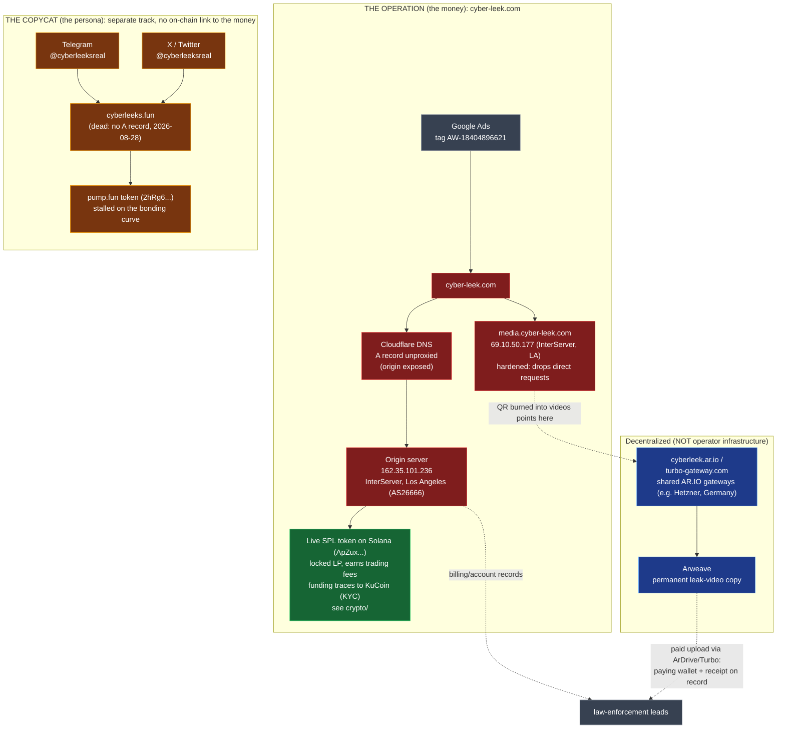

# Infrastructure

Hosting, DNS, certificates, media delivery, and how the operation is
wired end to end.

> **Two fronts.** This maps the wiring of the money operation
> (`cyber-leek.com`, its media host, and the Arweave leak distribution) and the
> **copycat's** now-dead `cyberleeks.fun` domain. `cyber-leek.com` is the
> operation; `cyberleeks.fun` is the copycat persona. They are
> two separate tracks; see the repo root.

*Live front page of `cyber-leek.com`: the token contract address
(`ApZuxdpzMrbEYTGEzeY9afh5pj9d6qPRJCTgQYiipbKg`, the SPL "site CA" in the
on-chain table below), a "BUY NOW AND GET 50% FREE" marquee, and a paid
"GTA6 TEST PLAY ... ONLY 499$" offer. Archived: https://archive.ph/cpbHi*

## In plain terms

A website is not a magic cloud thing. It is a set of files sitting on a
computer that stays switched on and connected to the internet around the
clock. That always-on computer is called a **server**. Almost nobody buys a
whole physical machine to do this; they rent one. The common, cheap way to
rent is a **VPS (Virtual Private Server)**: one powerful physical computer in
a data center is divided into many independent virtual ones, and you rent a
slice by the month and control it remotely over the internet. Think of
renting one apartment in a large building instead of buying the whole
building. CyberLeek's website runs on rented servers at a hosting company
called **InterServer**, in Los Angeles.

Every server has an **IP address**, a string of numbers like `162.35.101.236`
that is its location on the internet, the way a street address locates a
house. People do not type numbers, so we use names like `cyber-leek.com`
instead. The service that translates the name into the number is **DNS (the
Domain Name System)**, the internet's phone book.

Here is why any of this matters. A careful operator hides his server's real
IP address behind a shield service (a well-known one is **Cloudflare**), which
sits in front of the real machine like a receptionist, so outsiders only ever
see the shield and never the computer behind it. CyberLeek uses Cloudflare for
the phone-book (DNS) part, and registered the domain through Cloudflare too, but
never switched the shield on, so the real server address is exposed. That is a serious mistake: it points anyone, law
enforcement included, straight at the actual rented computer. The leak videos
are served from a second rented server and also copied onto **Arweave** (a
decentralized "permanent" storage network that is hard to take down), and the
whole operation is advertised through **Google Ads**.

The bottom line for a non-technical reader: the operator tried hard to stay
hidden, but every layer here, the servers, the domain name, the ad account,
the video storage, is rented from a real, subpoenable company (mostly US or
US-reachable) that keeps some record: a payment trail, an email, and the IP
addresses he connected from. He hid from the public. Whether he also hid from
law enforcement depends on two things the public data cannot yet answer: how he
paid, and whether he ever logged in to his own server without a VPN.

### InterServer, how he paid, and whether a VPN saves him

The origin host is **InterServer**, a US company registered in Englewood Cliffs,
New Jersey ([BBB](https://www.bbb.org/us/nj/englewood-cliffs/profile/web-hosting/interserver-inc-0221-90153894/customer-reviews)).
Two things about it decide how far the exposed IP leads.

First, InterServer does no identity KYC. A hands-on review shows signup verified
by an emailed code only, no government ID and no phone check ([HostAdvice](https://hostadvice.com/hosting-company/interserver-reviews/));
a hosting company is not a bank and carries no know-your-customer duty. What it
does carry is US jurisdiction: a US records request reaches whatever it holds,
however weak the signup was.

Second, InterServer takes crypto, Bitcoin, Ethereum and Tether through Coinbase,
and will even refund to a wallet ([WebsitePlanet](https://www.websiteplanet.com/blog/web-hosting-companies-that-accept-bitcoin/); [HostAdvice](https://hostadvice.com/hosting-company/interserver-reviews/)).
So the operator could have rented the box with no card and no bank name. That
removes the easy billing identity, but not the trail:

- A Coinbase payment still settles on-chain. If the wallet that paid for the
  server (or the domain, or Google Ads) sits in the same cluster this
  investigation already traced back to KuCoin, the infrastructure spend links
  straight into the identity trail. That is a concrete on-chain lead to run:
  look for outflows from the traced wallets to a Coinbase Commerce or InterServer
  payment address in the Aug 22 to 25 window.
- The account email and, above all, the server and control-panel logs do not
  care how he paid. Those logs record the IP addresses he connected from to run
  the box.

This is where a VPN is the whole question. The exposed origin IP tells law
enforcement which InterServer box to subpoena; the prize inside is the
connection log, the record of every IP that logged in to run the machine (SSH,
the control panel, file uploads). SSH into that box straight from his own
connection and the log holds his real residential IP: subpoena InterServer for
the box, subpoena the ISP for the subscriber, and there is a name, with the
crypto payment never having to break. Route that same SSH through Tor or a
no-logs VPN in an uncooperative jurisdiction and that layer can dead-end the
trail. The public evidence cannot say which; it only guarantees investigators
get to ask.

## Infrastructure indicators

### Web and delivery

| Indicator | Value | Notes |
| --- | --- | --- |
| Primary domain | `cyber-leek.com` | resolves **directly** to the origin (Cloudflare DNS, but the A record is unproxied - no CDN masking the origin) |
| Origin server IP | `162.35.101.236` | InterServer, Inc - AS26666 - Los Angeles, US |
| Media subdomain (video delivery) | `media.cyber-leek.com` | resolves to `69.10.50.177` (2nd InterServer IP) |
| Media server IP | `69.10.50.177` | InterServer, Inc - AS26666 - Los Angeles, US |
| Copycat domain | `cyberleeks.fun` | the **copycat persona's** site, pushed by @cyberleeksreal (archived: https://archive.ph/rYIMI); no A record as of 2026-08-28 |
| Arweave gateway (QR target) | `cyberleek.ar.io` | permaweb copy of the branded leak distribution |
| Fallback gateway | `cyberleek.turbo-gateway.com` | printed on the in-video QR ("if blocked, change gateway") |

### Tracking and paid acquisition

The site loads a single Google tag (`AW-18404896621`) whose config binds four
Google tag IDs together, so one Google account sits behind all of them. All are
delivered on `cyber-leek.com`; none of them appear on the copycat's `cyberleeks.fun`.

| Indicator | Value | Notes |
| --- | --- | --- |
| gtag loader (in page source) | `https://www.googletagmanager.com/gtag/js?id=AW-18404896621` | archived: https://archive.ph/oPlW4 |
| Google Ads account 1 | `AW-18404896621` | the tag loaded in the page source |
| Google Ads account 2 | `AW-18405840843` | linked in the same gtag config |
| Google Tag container 1 | `GT-P8ZRMZD5` | linked in the same gtag config |
| Google Tag container 2 | `GT-KVMKLRPR` | linked in the same gtag config |

The four IDs come from the linked-tags list returned inside the gtag.js response
for `AW-18404896621` (`AW-18404896621|GT-P8ZRMZD5|AW-18405840843|GT-KVMKLRPR`).
Two Google Ads conversion accounts and two Google Tag containers under one setup
is the operation's paid-acquisition machinery, and each is a billing/account
record Google holds.

### On-chain: which mint is which

Two different token mints carry the CyberLeek name, on different token programs.
They do not connect on-chain, and keeping them straight is the whole point of the
split:

- **The operation (the money):** the classic SPL token `ApZux...`, the contract
  address shown on `cyber-leek.com`. Locked liquidity, trading-fee income, funding
  traced back to KuCoin (see [`crypto/`](../crypto/)).
- **The copycat (the persona):** the pump.fun Token-2022 `2hRg6...`, pushed by the
  `@cyberleeksreal` persona. It stalled and never caught real money.

| Track | Indicator | Value | Notes |
| --- | --- | --- | --- |
| **Operation** | Live token (site CA) | `ApZuxdpzMrbEYTGEzeY9afh5pj9d6qPRJCTgQYiipbKg` | The money. Classic SPL, \~729.95M supply, 9 decimals; the CA displayed on `cyber-leek.com`; locked LP plus trading fees; funding traces to KuCoin. Verified on Solscan (re-pull 2026-08-28). |
| **Copycat** | Persona token | `2hRg6EhT2Z21xKPDnzniENFbQzLazoSjwt6K26bKpump` | The persona. Token-2022 "Cyber Leeks Real" / CYBERLEEKS, 1,000,000,000 supply, 6 decimals, authority renounced; launched on pump.fun, pushed by `@cyberleeksreal`, stalled. Verified on Solscan. |
| **Copycat** | Persona token deployer | `HhFaWEVRSktrUo3TnUdVrDmE6LHbkEi5rwNyR85P2GSB` | Persona side. Fee payer on the CYBERLEEKS mint-creation tx (2026-08-25T06:33:48Z). |
| **Copycat** | Deployer funding (bridge-in) | Relay solver `F7p3dFrjRTbtRp8FRF6qHLomXbKRBzpvBLjtQcfcgmNe` | Persona side. A cross-chain bridge-in that seeded the copycat deployer; shared bridge infrastructure, not the operator, and not linked on-chain to the operation token. |
| Both | Trading venues referenced | pump.fun, Raydium, Jupiter, DexScreener | linked from `cyber-leek.com` |

### DNS and certificates

- `cyber-leek.com`: nameservers on Cloudflare (`crystal` / `nash.ns.cloudflare.com`), but the A record is **unproxied**, so it returns the raw origin IP (`162.35.101.236`, InterServer, Los Angeles, AS26666), not a Cloudflare edge. The origin is exposed.
- `cyberleeks.fun` (copycat): **no A record** since **2026-08-28**; NS on NS1 (`dns1`-`dns4.p03.nsone.net`). Last seen serving (HTTP 200) at **2026-08-25 21:40:41 UTC** (Wayback Machine, its only capture), so it went dark in the Aug 25 to 28 window. Archived while live: https://archive.ph/rYIMI
- **The site went down between 2026-08-25 and 2026-08-29.** The Wayback Machine has it serving (HTTP 200) as late as **2026-08-25 18:36:26 UTC** (its last archived capture, with no error captures after); by our first direct check on **2026-08-29** it returned HTTP 000 (down). The exact moment it stopped serving is inside that window and is not independently recorded. The InterServer IPs still resolve, reverse DNS `vps3572431` / `vps3577375.trouble-free.net` (InterServer VPS instances). DNS outlives a stopped server; the InterServer account behind the IPs stays the seizable record.
- **`cyber-leek.com` was registered 2026-08-22 06:36:48 UTC** through **Cloudflare, Inc.** (RDAP + WHOIS, IANA registrar 1910; status `clientTransferProhibited`). Its first Let's Encrypt cert followed on **2026-08-24** (Certificate Transparency), and the earliest independent archive snapshot is **2026-08-24 14:20 UTC** (archive.today). So the clearnet front stood up in the **Aug 22 to 24** window. The leak *content* is older: the on-chain setup began **2026-08-13** and the Arweave leak-upload key was active from **2026-08-15**, before the clearnet domain existed.
- **The copycat domain `cyberleeks.fun` was registered 2026-08-25 12:11:02 UTC** through **HOSTINGER operations, UAB** (WHOIS), NS on NS1. A **different registrar** from the operation's Cloudflare, registered three days later, the same day as the copycat pump.fun token and the first Telegram post. The registrar split is one more line between the two tracks.

Recon evidence is two files, one per track, produced by the scripts in [`recon/`](recon/): `operation-recon-<date>.txt` (run [`recon/recon-operation.sh`](recon/recon-operation.sh)) and `copycat-recon-<date>.txt` (run [`recon/recon-copycat.sh`](recon/recon-copycat.sh)). Each captures DNS, IP ownership and reverse DNS, the domain registrar (RDAP + WHOIS), TLS, Certificate Transparency and HTTP status; the operation script also checks the Google Ads tag. Both are hashed in [`EVIDENCE.md`](../../EVIDENCE.md) once generated.

### Media delivery

- **Media host:** `media.cyber-leek.com` resolves to `69.10.50.177`, a second InterServer IP, distinct from the main origin.
- **Hardened while live:** through the 2026-08-28 pull the media host dropped external non-browser requests (`curl` code `000`) and the origin rate-limited them; the videos were reachable only through the site's own flow. Since the site went down (2026-08-29) a `000` now just means offline.
- **Origin: dark web, then permaweb, then clearnet.** Per GTAForums user Vice Cit, the leaks were first posted on the dark-web forum **Dread**, hours before anywhere else, then mirrored to **Arweave** (first upload 2026-08-15), and only later fronted by the clearnet `cyber-leek.com` (domain registered 2026-08-22). The dark-web post carries no on-chain timestamp; the Arweave and domain dates are hard.
- **Also on Arweave.** The circulated leak video carries a burned-in QR to a permanent Arweave copy, with a fallback gateway (`cyberleek.ar.io` / `cyberleek.turbo-gateway.com`, "if blocked, change gateway"). Arweave is content-addressed and decentralized, so no single takedown removes it, but the upload was **paid for through a wallet**, leaving a traceable receipt (paying wallet plus upload tx, via ArDrive / Turbo).

**The gateway IPs are not the operator's.** `cyberleek.ar.io` resolves to the public AR.IO gateway network (for example Hetzner nodes in Germany), which serves thousands of unrelated names, presents a `*.ar.io` wildcard certificate, and returned HTTP `451` for this name (something an operator does not do to his own content). The operator's own seizable host is the InterServer origin (`162.35.101.236`); gateway IPs are not attributed to the operator anywhere in this repo.

## How it is wired (two tracks, and where each breaks)

The stack at a glance, split by track. Red is the operation's own, seizable
infrastructure behind `cyber-leek.com` (every box keeps billing or account
records). Amber is the copycat persona's separate front (the `@cyberleeksreal`
Telegram and X accounts, the `cyberleeks.fun` domain, and the stalled pump.fun
token); on-chain it does not connect to the money. Blue is shared decentralized
infrastructure that is nobody's to seize; green is the live token where the
money is made. The Google ad account drives traffic to the operation; the
Telegram and X accounts belong to the copycat.

The operation is deliberately layered so that no single public lookup
exposes the operator. That same layering is its weakness: every layer is
run by a real company that keeps billing and account records.

**Front to back:**

1. **Paid traffic.** Google Ads (tag `AW-18404896621`) drives victims to the site. Google holds the advertiser's billing identity.
2. **Front door.** `cyber-leek.com` resolves **directly** to `162.35.101.236`, an InterServer server in Los Angeles (AS26666). Cloudflare handles the domain's DNS **and is its registrar** (IANA 1910), but the record is unproxied, so the host IP is exposed. The registrant account behind the domain sits with Cloudflare.
3. **Origin host.** InterServer (US, Englewood Cliffs NJ) runs that server and holds the hosting account, email, connection logs and payment trail behind it. No identity KYC at signup, but a US company and so subpoenable.
4. **Content distribution.** The leak videos are served from a second InterServer host (`media.cyber-leek.com`, `69.10.50.177`) that refuses direct requests, and are mirrored on Arweave (`cyberleek.ar.io`, `turbo-gateway` fallback) via ArDrive / Turbo - the Arweave uploads are paid for, with the paying wallet and receipt on record.
5. **The token.** The live `$CYBERLEEK` is a classic SPL token with locked Raydium liquidity, traded on Raydium / Jupiter and tracked on DexScreener. A separate pump.fun token of the same name (the persona's) stalled and is not part of this operation.
6. **The money.** The token's liquidity is locked (Raydium burn-and-earn) and the operation earns the trading fee on every trade; the 270M dev allocation was burned. The whole setup was paid for by one funding wallet whose SOL traces back six hops to a KuCoin (KYC) account, the identity lead. See [`crypto/`](../crypto/).

**Why it's hard to track from the outside:**

- Arweave is decentralized and permanent - no host to lean on, no simple owner lookup.
- The proceeds never leave in a lump. The liquidity is locked and the operator earns a trading fee on every trade, so there is no single off-Solana cash-out to chase. The identity lead is on the funding side (KuCoin), not on a payout.

**Why it's still reachable - the companies in the middle:**

Every layer is operated by an identifiable company that keeps records tying it to a paying account:

- **Google** - the Ads billing identity behind the operation's own ad account (tag `AW-18404896621`, loaded on `cyber-leek.com`; archived: https://archive.ph/oPlW4)
- **Cloudflare** - registrar *and* DNS for `cyber-leek.com` (IANA registrar 1910); the registrant account and billing behind the operation's domain sit here. **Hostinger** is the registrar for the copycat's `cyberleeks.fun`.
- **InterServer** (origin host, `162.35.101.236`, AS26666) - the server account, email, connection logs and payment trail. A US company (Englewood Cliffs, NJ) with no ID check at signup that accepts crypto; see the note above on why payment method and connection logs, not KYC, are what identify the renter
- **ArDrive / Turbo** - the wallet and receipt that paid for the Arweave uploads
- **KuCoin** - the KYC exchange the setup funding traces back to, six hops from the funding wallet; the account records behind that deposit are the identity lead, reachable through KuCoin's law-enforcement request process (MLAT for the Seychelles entity). See [`crypto/`](../crypto/) for the KYC detail and sources.
- **Raydium** - the locked-liquidity market the operation earns its fees from; on-chain and public, but the income is a fee stream, not a withdrawal to chase

None of these are reachable by a researcher from the outside. All of them
are reachable by law enforcement with a records request. The public
evidence in this repo is what points a records request at the right company.
