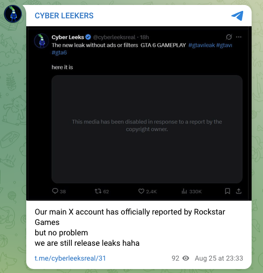

# Language and writing style

Documented language from the operator's official channels. Every item is
a direct quote from captured copy; the notes are limited to what is
observable in the text. This is a language observation, not an
identification.

## Sources

- `cyber-leek.com` / `cyberleeks.fun` site copy
- Telegram channel `t.me/cyberleeksreal` (analyzed in its own section below)

## Observed patterns (with quotes)

**Currency symbol after the number:**
> "ONLY 499$"

(US English writes `$499`.)

**"Last" where standard English uses "latest":**
> "Access GTA 6 LAST BUILD"

**Space before question and exclamation marks:**
> "REALLY ? YOU WILL MISS IT ?"
> "the official Rocstar Gta6 BUILD ! ALL FILES !" (cyber-leek.com/contact, archived: https://archive.ph/MXR1L)

(A space before `!` and `?` is standard French/European typography; recorded as a punctuation habit, not a language claim.)

**Missing apostrophe:**
> "DONT MISS THE SECOND RUN"

**Dropped final "s" in "access":**
> "GTA6 TRIAL PLAY ACCES" (cyber-leek.com/contact, archived: https://archive.ph/MXR1L)

(`acces` matches the French `accès`; recorded as a spelling fact, not a language claim.)

**Dropped "k" in "Rockstar":**
> "the official Rocstar Gta6 BUILD"

**Crypto / market vernacular (fluent):**
> "50MC GOAL IS SOOOO EASY FOR US ... All you guys will be RICH!"
> "+642% in the last 24 hours. Read that again."

(`MC` = market cap; `50MC` = a $50M target.)

**Authenticity framing (Telegram):**
> "The Only Real Cyberleek - I'm officially on Telegram"

---

## Telegram messages

Sample: 12 posts from `t.me/cyberleeksreal` (verbatim in
[`telegram-messages.txt`](telegram-messages.txt)). Same method - every
marker below is a direct quote.

### Hashtag signature: the dotless "ı"

*Telegram post `t.me/cyberleeksreal/24` (archived: https://archive.ph/I0X9X).*

The recurring hashtag is written **`#gtavıleak`** - using **`ı`
(U+0131, Latin small letter dotless i)** in place of the ASCII `i`. The
same dotless character recurs in `#gtavı` and `#gtavıleaks`. This is a
consistent, non-standard substitution across multiple posts and is a
distinctive stylistic fingerprint. (U+0131 is the dotless i of
Turkish/Azerbaijani orthography; recorded here as a character-usage fact,
not a location claim.)

Full hashtag set observed: `#gtavıleak`, `#gtavı`, `#gtavıleaks`,
`#GTAVI`, `#RockstarGames`, `#GTA6News`, `#GTA`, plus `@RockstarGames`
mentions.

### Currency symbol after the amount (now confirmed on both channels)

> "THIS WILL MAKE 300K+$"
> "ROI 115K$"
> "INVEST IT ONLY 20$"

Matches the site's "ONLY 499$" - a consistent post-fixed currency symbol
across the site and Telegram.

### "GAVE" for "give" (repeated)

> "THIS WILL GAVE YOU ROI 115K$"
> "I WILL GAVE HIM LEAKS"

The same tense substitution appears twice.

### Other broken-English markers (quoted)

*Telegram post `t.me/cyberleeksreal/31` (archived: https://archive.ph/9J4OI).*

> "DON'T JUDGE A BOOK BY IT'S COVER" - "IT'S" used for possessive "its"
> "if you boost this i will give you one more leaks" - "one more leaks" (number/plural disagreement)
> "JUST YOU NEED GO" - dropped "to"
> "Rockstar just reached to me" - "reached to me" for "reached out to me / reached me"
> "Our main X account has officially reported by Rockstar Games" - missing "been" (broken passive)
> "we are still release leaks" - for "we are still releasing leaks" (verb form)
> "rockstar is jumpingon it" - missing space
> "IF MY POEPLE MAKE MONEY" - "POEPLE" for "people"
> "OUR TWTTER ACCOUNT" - "TWTTER" for "Twitter"

### Punctuation habit: two-dot ellipsis

> "They want us to stop..   They thought I'd take their money. Fools..   They're scared of us.."
> "Good morning guys.. More leaks coming today.." (t.me/cyberleeksreal/33, archived: https://archive.ph/zkVZh)

Consistent `..` (two dots) rather than `...`.

### Hype register

> "SUUUUUUUUUUUUUUUUUU!", "HAHA  BOOM!", "ROCKSTAR GAMES ARE WEEPING IN THE CORNER HAHA"

## Reading

The same non-standard conventions appear on **both** the site and
Telegram - the post-fixed currency symbol (`499$` / `300K+$` / `20$`),
and consistent non-native grammar (dropped articles, "gave" for "give",
broken passive). Combined with the dotless-`ı` hashtag signature, this is
a consistent authorial style across channels. These are observations
about the writing; they do not identify a location, a native language,
or whether one or more people produced the copy. Several markers (the
post-fixed currency symbol, the space before punctuation, `acces` for
`access`) align with French/European writing conventions, while the dotless
`ı` is a Turkish/Azerbaijani character; these associations are noted as
observations and are not used here to claim a native language or origin.
